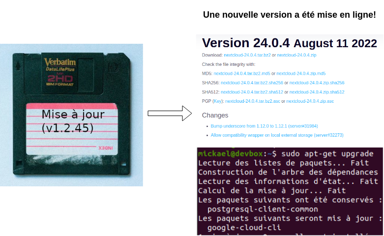

# Introduction à la méthode DevOps

 

    

---

# Sommaire

* [Les origines de DevOps](#les-origines-de-devops)
* [Les principes de DevOps](#les-principes-de-devops)

---

# Les origines de DevOps

* La démocratisation d'internet
* Les géants du web
* L'agilité dans les développements
* L'automatisation des tests sur le code
* L'intégration continue
* La démocratisation du cloud
* Les limites de l'exploitation traditionnelle
* La naissance du terme DevOps

---

## La démocratisation d'internet

La fin des années 90 marque le début de la démocratisation d'internet :

    

Le nombre de clients potentiels pour une application en ligne suivra cette courbe.

---

## Les géants du web (1/3)

Les **[géants du web](https://fr.wikipedia.org/wiki/G%C3%A9ants_du_Web)** naîtront sur cette période et feront rapidement face aux requêtes de **plusieurs millions d'utilisateurs** :

* Amazon (1994)
* Netflix (1997)
* Google (1998)
* Facebook (2004)
* ...

---

## Les géants du web (2/3)

Ils répondront par des **architectures scalables** avec de nouvelles approches au niveau des traitements (ex : [MapReduce (2004)](https://fr.wikipedia.org/wiki/MapReduce)) et du stockage (ex : [stockage NoSQL](https://fr.wikipedia.org/wiki/NoSQL))

---

## Les géants du web (3/3)

Ces acteurs seront aussi des pionniers en matière de DevOps en répondant avec une nouvelle approche en matière de gestion des infrastructures. 

En 2003, Google pose un nouveau rôle : Le [Site Reliability Engineer (SRE)](https://sre.google/books/) qui doit assurer un haut niveau de disponibilité des services **collobaration étroite avec les développeurs**.

---

## L'agilité dans les développements (1/2)

La démocratisation d'internet et des applications en réseau se traduira aussi par **la possibilité de livrer à moindre frais des évolutions et des correctifs**

    

---

## L'agilité dans les développements (2/2)

La publication du **[manifeste agile](https://manifesteagile.fr/) en 2001** marquera un tournant dans les méthodes de développement en exploitant cette possibilité.

L'agilité incluera entre autre de :

* **Livrer rapidement et régulièrement** une nouvelle version de l'application.
* **Faire travailler ensemble** les personnes en charge du **métier ou des affaires** et les personnes en charge de la **réalisation** au quotidien tout au long du projet.

---

## L'automatisation des tests sur le code

Livrer rapidement et régulièrement est **incompatible** avec le fait procéder à de longues **recettes manuelles** pour **éviter l'introduction de bug**.

L'agilité se décline en plusieurs méthodes de développement qui incitent à **réduire le risque de régression** à l'aide de **tests unitaires et fonctionnels**.

On citera par exemple **[Test-driven development (TDD)](https://en.wikipedia.org/wiki/Test-driven_development)** formalisée **en 2003** par Kent Beck.

---

## L'intégration continue

Les outils d'**intégration continue** tels [Hudson sorti en 2005](https://en.wikipedia.org/wiki/Hudson_(software)) (forké et renommé en [Jenkins](https://www.jenkins.io/)) gagnent en popularités. Ils sont utilisés entre autre pour :

* **Centraliser l'exécution des tests** (et s'assurer qu'ils sont bien exécutés)
* Présenter pour tous les **rapports d'exécution des tests**
* **Produire des livrables** à déployer (archive zip/tar, paquet debian/centos, installeur)

---

---

## La démocratisation du cloud (1/2)

### Un coût d'entrée faible pour la scalabilité

En 2006, Amazon lance deux services qui vont contribuer à populariser le concept d'informatique en nuage :

* [Amazon S3](https://en.wikipedia.org/wiki/Amazon_S3) pour le stockage de données.
* [Amazon Elastic Compute Cloud (EC2)](https://en.wikipedia.org/wiki/Amazon_Elastic_Compute_Cloud) pour l'exécution d'application.

Avec ces services :

* Disposer d'une infrastructure de stockage et de calcul capable de s'**adapter à la charge** n'est plus réservée à quelques grands groupes.
* La **facturation à la consommation** donne l'opportunité aux entreprises de taille modeste d'**introduire un nouveau service qui ne sera pas victime de son succès**.

---

## La démocratisation du cloud (2/2)

### Une conception permettant l'automatisation

Au niveau d'AWS, Jeff BEZOS posera une règle d'architecture importante : **Toutes les communications entre les projets doivent passer par l'exposition et l'utilisation d'API en réseau** ( c.f. [The API Mandate: How a mythical memo from Jeff Bezos changed software forever](https://konghq.com/jblog/api-mandate) ).

Ceci jouera beaucoup dans :

* La capacité d'AWS à accroître efficacement son offre de service (couplage faible, interfaces clairement définies,...)
* La capacité des clients à **automatiser l'utilisation des ressources mise à disposition par AWS** (des appels à un service étant plus facilement automatisable que des clics dans une interface graphique)

Remarque : On notera que cette règle s'applique aux <u>communications entre les services</u> (s'efforcer de construire toutes ses applications sur la base d'API REST/JSON est assez limitant).

---

## Les limites de l'exploitation traditionnelle (1/6)

### Une séparation stricte des rôles

A ce stade, les méthodes agiles ont rapproché le métier et les développeurs, l'**exploitation traditionnelle** se traduit généralement par un **processus sacralisant un cloisonnement stricts des rôles entre les DEV et les OPS**.

---

## Les limites de l'exploitation traditionnelle (2/6)

### Une communication centrée sur des documents

On trouvera par exemple le processus suivant pour déployer une application :

* Les DEV préparent une version à déployer (ex : `v0.1.0`)
* Les DEV rédigent un **dossier d'architecture Technique (DAT)** (schéma d'architecture, description des services, dimensionnement demandé, URL à exposer...).
* Les DEV régigent un **dossier d'exploitation (DEX)** décrivant les procédures d'installation, le paramétrage, les éléments à surveiller...
* Les OPS **provisionnent l'infrastructure** à partir du DAT et du DEX (création des VM, configuration réseau, reverse proxy,...)
* Les DEV valident le déploiement
* Les OPS surveillent l'infrastructure et traitent les problèmes techniques.

---

## Les limites de l'exploitation traditionnelle (3/6)

### Une approche en apparence sécurisée

* Seuls des **administrateurs systèmes configurent le système** ([ce qui conforme à la PSSIE rédigée en 2014...](https://www.ssi.gouv.fr/entreprise/reglementation/protection-des-systemes-dinformations/la-politique-de-securite-des-systemes-dinformation-de-letat-pssie/))
* Les **développeurs** sont **déchargés des problématiques d'exploitation**

**C'est oublier la loi de Murphy!**

---

## Les limites de l'exploitation traditionnelle (4/6)

### Une approche qui empêche de livrer rapidement et régulièrement

La **mise en production initiale** de l'application prendra alors facilement **1 mois** pour diverses raisons :

* Problème de **compréhension du DAT ou du DEX**
* Problème de **complétude du DAT ou du DEX**

Il en sera de même pour **chaque évolution induisant le moindre d'architecture** (ajout d'un service support, changement de méthode de gestion d'un paramètre,...) ce qui laissera deux options :

* Conserver volontairement une **architecture non optimimale**.
* **Regrouper de nombreuses transformations** dans une version majeure où la **livraison sera longue et risquée**.

---

## Les limites de l'exploitation traditionnelle (5/6)

### Une approche qui génère des problèmes en production

Une **demande d'exploitation ou une procédure** est **mal comprise** ou **mal traduite en opérations**.

On soulignera que :

* **Les OPS** n'étant pas partie prenante dans la conception de l'application **ne peuvent avoir un regard critique et une compréhension des demandes** (une mise à jour devient une montée en version, une action demandée en QUALIFICATION est appliquée en PRODUCTION,...)
* **Les DEV** n'étant pas partie prenante dans la conception de l'infrastructure **n'exploitent pas le système de manière optimale** (utilisation du mauvais système de stockage, saturation de débit réseau,...)

---

## Les limites de l'exploitation traditionnelle (6/6)

### Une approche amenant à chercher un coupable plutôt qu'une solution

La frontière entre les rôles se traduit humainement par une tendance des équipes DEV et OPS à **chercher à limiter leur responsabilité en cas de problème** plutôt qu'une recherche collective pour **éviter l'apparition de problèmes** voire **corriger rapidement un problème**.

Typiquement, avant de chercher une solution :

* Il faut prouver côté DEV que le problème n'est pas au niveau du code pour que les OPS commencent à analyser les logs.
* Il faut prouver côté OPS que le problème est lié à une augmentation de la consommation non compatible avec la conception initiale.

Voir [www.commitstrip.com - Comment savoir si votre entreprise est DevOps?](https://www.commitstrip.com/fr/2015/02/02/is-your-company-ready-for-devops/?).

---

## La naissance du terme DevOps (1/2)

Le terme DevOps naîtra d'une prise de conscience sur ces problématiques :

* En 2008, une conférence Agile à Toronto permet la rencontre entre l'organisateur d'une rencontre sur le thème **« Infrastructure Agile »** et un chef de projet Patrick Debois faisant face au manque de  **cohésion entre les équipes de développement d'applications et les équipes d'exploitation**
* En 2009, deux responsables de Flickr proposent une solution à ce problème : Embaucher des **« Ops qui pensent comme des Devs »** et des **« Devs qui pensent comme des Ops »**.
* En 2009, Patrick Debois contracte **développements (DEV)** et **opérations (OPS)** dans un hashtag pour annoncer la première [DevOpsDays](https://devopsdays.org/): **DevOps est né**.

(voir [devopssec.fr - L'histoire du DevOps](https://devopssec.fr/article/histoire-du-devops) qui aborde tout ça plus en détail)

---

## La naissance du terme DevOps (2/2)

DevOps dépassera à ce titre la simple problématique de l'automatisation des déploiement. DevOps est avant tout un constat :

* Pour pouvoir **livrer régulièrement et fréquemment des applications** et **s'adapter à la charge**, l'**agilité dans la gestion des infrastructures**.
* Pour introduire de l'**agilité dans les infrastructures**, il faut un **rapprochement entre les activités de développement (DEV) et d'exploitation (OPS)**.

---

# Les principes de DevOps

* Un objectif commun
* Un processus unifiant le DEV et l'OPS
* Le modèle CALMS (Culture, Automation, Lean, Measurement & Sharing)
* Infrastructure as Code
* GitOps
* Docs as Code

---

## Un objectif commun (1/2)

La séparation des DEV et des OPS conduit à des objectifs distincts :

* Les DEV veulent livrer rapidement des évolutions
* Les OPS doivent avant tout assurer la disponibilité

Il en résulte le mur de la confusion :

---

## Un objectif commun (2/2)

Pour rémédier à cette situation, il sera impératif de **replacer au centre le(s) produit(s)** et la **création de valeur** en fixant un commun aux DEV et OPS :

**Livrer rapidement des évolutions tout en assurant la disponibilité**

---

## Un processus unifiant le DEV et l'OPS (1/2)

Le partage de ce même objectif conduira à **unifier les processus de développement et de déploiement** :

    

---

## Un processus unifiant le DEV et l'OPS (2/2)

On reconnaîtra dans ce processus la **roue de Deming** bien connue dans le **domaine de la qualité** :

    
    

    (Source : <a href="https://commons.wikimedia.org/wiki/File:PDCA_Cycle_FR.svg">wikimedia.org - Michel Weinachter</a>)
    

---

## Un processus sujet à l'amélioration continue

Il convient de souligner que la mise en oeuvre d'un tel processus prendra du temps et qu'il sera toujours perfectible.

A ce titre, il conviendra d'**améliorer en continu ce processus**.

---

## Le modèle CALMS

### Culture (1/3)

Il convient de souligner que la **gestion des infrastructures est un sujet sensible**. Pour faire évoluer les pratiques et les processus, il faudra d'abord une compréhension partagée :

* De **ce qu'est l'agilité dans le développement** (et de ce que ça implique au niveau de l'exploitation, de la prévibilité des coûts, des plannings de livraison des fonctionnalités...) 
* Des **limites des méthodes d'exploitation traditionnelle** (d'où les nombreuses slides)
* Des **problèmes et améliorations possibles**

---

## Le modèle CALMS

### Culture (2/3)

Pour faire simple, avant de cibler une **infrastructure agile**, il faut être nombreux à voir qu'il y a un problème quand :

* Il faut des jours pour relivrer une application avec une mise à jour de ses dépendances (cas récent : [faille Log4Shell](https://fr.wikipedia.org/wiki/Log4Shell))
* Il faut exhumer une procédure pour re-déployer cette application (et croiser les doigts pour que le procédure soit à jour)
* Il faut faire signer une commande de VM pour faire face à un pic de charge (en ayant prévue la commande l'année précédente)
* Il faut maintenir des documents word contenant ces informations de dimensionnement
* ...

---

## Le modèle CALMS

### Culture (3/3)

En pratique, s'orienter vers la méthode DevOps sera délicat sans une **politique globale permettant l'agilité au niveau de l'entreprise**.

Nous trouverons à ce titre des **framework d'agilité à l'échelle** tels [Scaled agile framework (SAFe)](https://www.scaledagileframework.com/) qui inclueront DevOps dans une démarche plus globale.

Sans entrer dans les détails, avec des projets gérés avec des méthodes hétérogènes (Excel, JIRA, Teams, Redmine, GitHub,...), il sera par exemple difficile d'avoir des métriques pour mettre en évidence les problèmes et les améliorations.

---

## Le modèle CALMS

### Automatisation

DevOps mettra un fort accent sur **l'automatisation**. Elle prendra plusieurs formes :

* L'**automatisation des déploiements** pour éviter les erreurs humaines, livrer rapidement,...
* L'**automatisation des tests** pour limiter les risques liés à l'automatisation, réduire les temps de recette manuelle,...
* L'**automatisation de la surveillance** pour détecter et traiter rapidement les problèmes
* L'**automatisation de la génération de la documentation** pour s'assurer qu'elle correspond à l'état du système
* ...

---

## Le modèle CALMS

### *Lean*

Avec DevOps, on se concentrera sur la production de valeur en faisant la **chasse aux activités à faibles valeurs ajoutées** entre :

* Le début d'un développement
* La mise à disposition du résultat

---

## Le modèle CALMS

### Mesure (1/2)

"Ce qui ne se mesure pas n'existe pas" (et ce qui n'est pas affiché en rouge sur un graphique ne percutera pas au niveau de la direction).

A ce titre, on s'efforcera avec DevOps de **définir des objectifs et les métriques associées**. Par exemple :

| Objectif                                            | Exemples de métriques                                                             |
| --------------------------------------------------- | --------------------------------------------------------------------------------- |
| Déployer rapidement une nouvelle version            | Nombre de livraison par mois (ou par an au début)                                 |
| Assurer un haut niveau de disponibilité             | Taux de disponibilité                                                             |
| Assurer un haut niveau de performance               | Taux de réponse dans temps acceptable (SLA)                                       |
| Limiter le nombre d'incident                        | Nombre de ticket ouvert                                                           |
| Traiter rapidement les incidents                    | Durée de vie des tickets d'incident                                               |
| Traiter efficacement les problématiques de sécurité | Durée du déploiement d'un patch, nombre de vulnérabilité dans les dépendances,... |

---

## Le modèle CALMS

### Mesure (2/2)

On soulignera que définir des métriques et faire en sorte pouvoir les calculer est loin d'être trivial.

A titre d'exemple, il sera par exemple intéressant de :

* Prévoir une catégorisation des incidents pour distinguer les erreurs de programmation, les erreurs de déploiement, les problèmes d'infrastructure,...
* Prévoir plusieurs niveaux d'attente pour les performances des services (degradé, non acceptable)
* ...

---

## Le modèle CALMS

### Partage

Le **partage** et la **transparence** seront important à plusieurs niveaux. Ils favoriseront :

* La confiance entre les différents acteurs
* La compréhension partagées des objectifs et des enjeux
* Les transferts de compétences entre équipes
* ...

---

## Infrastructure as Code

L'approche **Infrastructure as Code (IaC)** sera fondamentale en matière d'**automatisation des déploiements**. Elle consiste à gérer une infrastructure informatique à l'aide de programmes :
  
* Les **procédures de déploiement** deviennent des **scripts de déploiements**.
* Les **informations prisonnières des documents** deviennent des **paramètres ou des secrets** pour ces scripts de déploiement.

---

## GitOps

L'approche [**GitOps**](https://www.redhat.com/fr/topics/devops/what-is-gitops) ira un cran plus loin que Infrastructure as Code :

* La branche principale du dépôt IaC sera le reflet de l'état du système
* La validation d'une **pull request** sur la branche principale déclenchera le déploiement

Ceci permettra entre autre de répondre à des problématiques de **tracabilité des déploiements** :

* Qui a lancé quelle version du script de déploiement?
* Qui a proposé/validé la configuration?

---

## Docs as Code

Pour la documentation, on soulignera l'importance de l'approche [**Docs as Code**](https://www.writethedocs.org/guide/docs-as-code/) consiste à **gérer la documentation avec les mêmes outils que ceux qui servent à construire des applications** :

* Le **système de gestion de ticket** permet de **gérer les évolutions et les anomalies**.
* Le gestionnaire de code source (GIT) permet de **versionner le code source de la documentation** et de **prévisualiser le contenu**.
* Le source du document est au format texte (Markdown, reStructuredText, Asciidoc).
* Le mécanisme de revue de code est utilisé pour les revues de documentation.
* La chaîne CI/CD permet de **générer et de publier la documentation**.

Cette approche a de nombreux avantages. Dans le cas de DevOps, elle est importante pour :

* Assurer la **cohérence entre la description du système et l'état du système**
* Ne pas **gaspiller de l'énergie en traitant manuellement des mises à jour de document**

