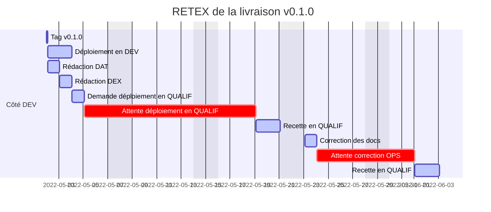

# Diagramme de Gantt illustrant l'efficacité de l'exploitation traditionnelle

Illustration de l'effet des temps d'attente sur la durée d'un déploiement avec :

* 2 semaines d'attente de l'équipe OPS sur le premier déploiement (temps de découverte de l'application, autres applications à traiter,...)
* 1 semaine d'attente pour un nouveau déploiement après reprise de la documentation (autres applications à traiter)

En complément, vous pourrez lire l'article [fr.kaizen.com - L'importance du Time to Market](https://kaizen.com/fr/publications/importance-time-to-market-fr/) qui aborde la notion d'**efficacité des flux** et des alternatives pour mettre en lumière l'effet des temps d'attente.
