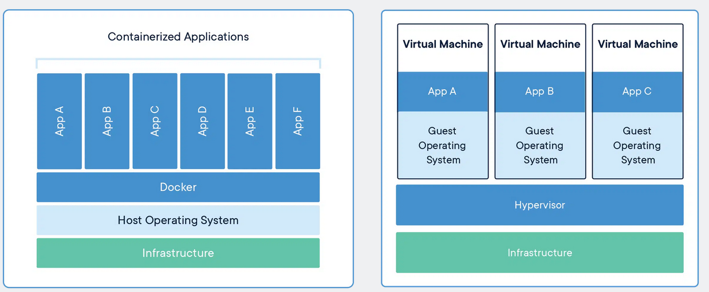
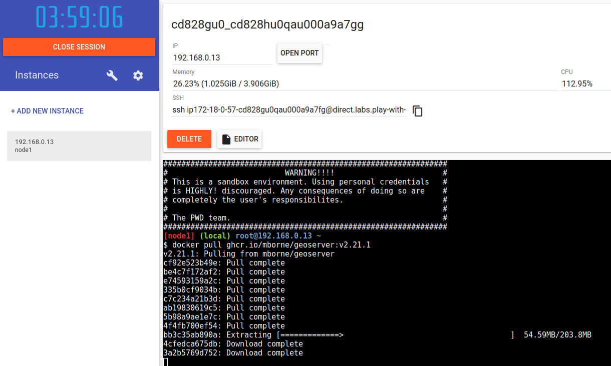

# DevOps avec des conteneurs

* Principe de fonctionnement
* Les principaux concepts
* Les principaux exécutables
* Les dépôts d'images
* Découvrir docker par la pratique
* Le déploiement de GeoStack
* L'intérêt des conteneurs
* Que manque-t'il à ce stade?

---

## Principe de fonctionnement

### Partage de l'OS et isolation des processus

Par rapport aux VM, nous soulignerons que les conteneurs docker sont basés sur des **fonctionnalités d'isolation du noyau Linux** :

<div class="center">
    
    <br />
    (source : <a href="https://www.docker.com/resources/what-container/">www.docker.com - Comparing Containers and Virtual Machines</a>)
</div>

Le **démarrage d'un conteneur sera plus rapide que le démarrage d'une VM** :

* Démarrer un conteneur = démarrer un processus isolé
* Démarrer une VM = démarrer un OS complet

---

## Principe de fonctionnement

### Utilisation d'un système de fichier par couche

Avec docker, nous trouverons un **concept d'image fonctionnellement identique à celui auquel nous sommes habitué avec les VM** (ex : les `.box` téléchargés par `vagrant` dans la partie précédente).

La deuxième optimisation notable de docker par rapport aux VM tiendra à l'**utilisation de système de fichier par couche ("overlay") pour matérialiser ces images**.

Cette approche permettra à docker d'**optimiser le téléchargement et la construction des images avec des mécanismes de cache**.

---

## Principe de fonctionnement

### La surcouche docker

Les mécanismes d'isolation ne sont pas nouveaux dans le noyau Linux (voir [LXC - LinuX Containers](https://fr.wikipedia.org/wiki/LXC) et [cgroups](https://fr.wikipedia.org/wiki/Cgroups)). [Les systèmes de fichiers par couches non plus](https://www.adaltas.com/fr/2021/06/03/linux-overlay-filesystem-docker/).

Docker apporte par contre un ensemble cohérent **de concepts et d'outils donnant un cadre pour construire et déployer efficacement des applications** en s'appuyant sur ces mécanismes.

---

## Les principaux concepts

### Vue d'ensemble des concepts

L'utilisation de docker amènera en effet à manipuler plusieurs concepts :

* Les **images** qui sont fonctionnellement équivalentes aux images de VM
* Les `Dockerfile` qui décrivent la construction d'une image à partir d'une image de base et d'instructions.
* Les **dépôts d'images (*registry*)** qui permettent de télécharger et stocker des images.
* Les **conteneurs** qui sont des instances des images se comportant comme des VM grace à des mécanismes d'**isolation**.
* Les **volumes** qui permettent d'externaliser les données des **conteneurs** ("montage de disque")
* Les **réseaux** qui permettent la communication entre les conteneurs.
* Le **démon docker** qui met à disposition [une API pour gérer les conteneurs, images, volumes, réseaux,...](https://docs.docker.com/engine/api/v1.41/).


---

## Les principaux exécutables

Nous utiliserons principalement les **clients en ligne de commande pour l'API docker** suivants :

* L'exécutable [**docker**](https://docs.docker.com/engine/reference/commandline/cli/) qui permettra de **manipuler individuellement les images, les conteneurs, les volumes, les réseaux,...**
* Son plugin [**docker compose**](https://docs.docker.com/compose/) qui permettra de **gérer des stacks au format YAML** (des services exécutant des conteneurs, des réseaux et des volumes,...)

---

## Les dépôts d'images

### Les dépôts d'images publics

Le plus connu est [DockerHub](https://hub.docker.com/search?q=) mettant à disposition :

* Des images d'OS : [ubuntu](https://hub.docker.com/_/ubuntu), [debian](https://hub.docker.com/_/debian), [alpine](https://hub.docker.com/_/alpine),...
* Des images pour des services : [postgres](https://hub.docker.com/_/postgres), [mongodb](https://hub.docker.com/_/mongodb), [redis](https://hub.docker.com/_/redis),...
* Des images pour des applications : [wordpress](https://hub.docker.com/_/wordpress), [jenkins](https://hub.docker.com/r/jenkins/jenkins),...

Pour déployer GeoStack, nous trouverons :

* Une image [postgis/postgis](https://hub.docker.com/r/postgis/postgis) pour le déploiement PostgreSQL
* De [nombreuses images GeoServer](https://hub.docker.com/search?q=geoserver)

Nous noterons toutefois qu'il existe d'autres dépôts d'images publiquement accessibles [quay.io](https://quay.io/) et [docker.elastic.co](https://www.docker.elastic.co/).

---

## Les dépôts d'images

### Les dépôts d'image privés

Nous noterons qu'il est possible de stocker des images avec des outils tels [Harbor](https://goharbor.io/) ou [Nexus](https://hub.docker.com/r/sonatype/nexus3) déployés en propre.

### Le dépôt d'image du gestionnaire de code source

Nous soulignerons le fait que la plupart des gestionnaires de code source (GitHub, GitLab, Gitea,...) intègrent désormais un système de stockage d'image docker (ghcr.io, registry.gitlab.com,...) ce qui :

* Évite de gérer en parallèle des droits au niveau d'un gestionnaire d'artefact
* Simplifie la publication la publication au niveau des orchestrateurs d'intégration continue (eux aussi intégrés aux gestionnaires de code source...)

### Le dépôt d'image des hébergeurs

Nous trouverons aussi l'existence de dépôt d'images au niveau des solutions d'hébergement (ex : Google Container Registry, Azure Container Registry,...).

---

## Découvrir docker par la pratique

### Principe

A l'instar de Ansible, il faudrait de nombreuses séances pour vous former réellement à l'utilisation de docker. Nous allons nous contenter d'une découverte des principaux concepts à l'aide d'exemples.

Pour approfondir sur cette technologie, vous pourrez suivre un cours dédié ou vous appuyer sur les ressources suivantes :

* [docs.docker.com - Docker overview](https://docs.docker.com/get-started/overview/)
* [container.training - Introduction to Containers](https://container.training/intro-selfpaced.yml.html#1)

---

## Découvrir docker par la pratique

### Installation de docker

Nous allons nous assurer d'avoir une installation fonctionnelle de docker permettant d'exécuter `docker run hello-world` :

* Vous pourrez **installer docker sur une VM Linux**
* Le site [labs.play-with-docker.com](https://labs.play-with-docker.com/) vous permettra de faire vos premiers tests en ligne :

<div class="center">
    
</div>

Pour l'installation dans une VM, il vous faudra principalement traiter la problématique du [proxy sortant](annexe/proxy-sortant/proxy-docker.html) et éventuellement la résolution DNS (option `dns` dans `/etc/docker/daemon.json`).

L'[annexe docker](annexe/docker/) s'efforce de fournir une aide sur ces points.

---

## Découvrir docker par la pratique

### Mise en garde

**Éviter d'installer directement le démon docker directement sur un poste de travail branché sur le réseau de votre école/entreprise**.

La configuration par défaut du démon (`/etc/docker/daemon.json`) devra être adaptée pour :

* Éviter les conflits d'IP entre les réseaux virtuels de docker et le réseau local (`bip` et `default-address-pools`)
* Définir les bonnes options de sécurité (voir [docker-bench-for-security](https://github.com/docker/docker-bench-security#docker-bench-for-security))
* ...


---

## Découvrir docker par la pratique

### Quelques exemples pour débuter...

Pour la prise en main de l'exécutable [docker](https://docs.docker.com/engine/reference/commandline/cli/) et la découverte des concepts, nous allons voir ensemble les exemples stockés dans un dépôt dédié annexé à ce cours :

* [mborne/docker-exemples](https://github.com/mborne/docker-exemples#docker---quelques-exemples)

Pour la prise en main de `docker compose`, nous utiliserons [mborne/docker-devbox](https://github.com/mborne/docker-devbox/#mbornedocker-devbox) qui est mon terrain de jeu pour docker et Kubernetes en démarrant :

* [mborne/docker-devbox - redis](https://github.com/mborne/docker-devbox/tree/master/redis)
* [mborne/docker-devbox - postgis](https://github.com/mborne/docker-devbox/tree/master/postgis)

---

## Le déploiement de GeoStack

### Principe

Après cette brève introduction, nous allons pouvoir reprendre le déploiement de GeoStack réalisé précédemment avec Ansible.

---

## Le déploiement de GeoStack

### La construction d'une image

Pour illustrer la construction d'une image docker à partir d'un `Dockerfile`, nous allons faire l'exercice de :

* Créer nous même l'image pour GeoServer
* Stocker cette image à l'aide de GitHub Container Registry (ghcr.io)

Nous inspecterons ensemble le dépôt [mborne/docker-geoserver](https://github.com/mborne/docker-geoserver#readme) correspondant et soulignerons que nous pourrons récupérer l'image comme suit pour la suite :

```bash
docker pull ghcr.io/mborne/geoserver:v2.21.1
```

---

## Le déploiement de GeoStack

### La construction d'une image

Nous trouverons ici la démonstration correspondant à l'utilisation d'un fichier `docker-compose.yml` pour démarrer les deux applications à l'aide d'un simple `docker compose up -d` :

[mborne/geostack-deploy - Déploiement de GeoStack avec docker compose](https://github.com/mborne/geostack-deploy/tree/master/docker#readme)

Nous soulignerons que sans "docker compose", nous serions amené à exécuter de nombreuses commandes docker.

---

## Le déploiement de GeoStack

### La mise en oeuvre d'un reverse proxy (1/2)

Avec Ansible, la mise en oeuvre d'un reverse proxy aurait induit par exemple l'installation et la configuration de nginx.

Avec docker, nous soulignerons l'existence de [traefik](https://doc.traefik.io/traefik/) doté d'un mécanisme de [configuration automatique permis par la présence d'une API au niveau de docker](https://doc.traefik.io/traefik/providers/docker/).

---

## Le déploiement de GeoStack

### La mise en oeuvre d'un reverse proxy (2/2)

En complément, nous constaterons que [traefik](https://doc.traefik.io/traefik/) faciliterait au passage la [mise en oeuvre de TLS](https://doc.traefik.io/traefik/https/overview/) et de bien d'autres points tels la [mise en oeuvre de limites de nombres d'appel par IP](https://doc.traefik.io/traefik/middlewares/http/ratelimit/)

---

## L'intérêt des conteneurs

En synthèse, nous soulignerons le succès de docker doit beaucoup aux points suivants :

* **L'image est un livrable universel** (plus besoin de choisir entre un .deb, .rpm, .war, .zip,...)
* **L'image est définie as code** via le `Dockerfile` (donc **reconstructible**)
* **L'image testée en DEV est celle qui s'exécute en PROD**
* Le **démarrage** des conteneurs est **rapide**.
* Les **téléchargements et constructions d'images sont optimisés**.
* L'API permet la construction d'un écosystème avec par exemple :
  * Le reverse proxy [traefik](https://doc.traefik.io/traefik/) qui se configure automatiquement en inspectant les conteneurs (**introspection**)
  * L'IHM [portainer](https://www.portainer.io/) qui permet de démarrer des conteneurs (**réflexion**)


---

## Que manque-t'il à ce stade?

En l'état, si cherchions à héberger GeoStack sur plusieurs machines, nous remarquerions que :

* Les conteneurs sur **la machine A ne peuvent communiquer avec ceux de la machine B**
* Les démons docker sur les machines ne se connaissent pas (un outil tel [traefik](https://doc.traefik.io/traefik/) devrait moissonner deux API distinctes)
* Il nous serait délicat de mettre en oeuvre un volume partagé par les conteneurs sur les deux machines.

