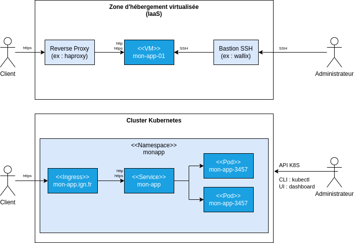
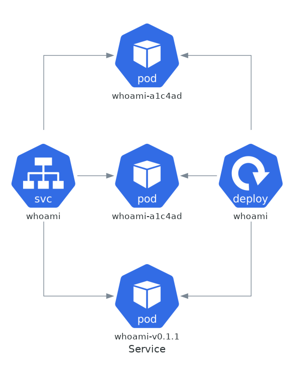
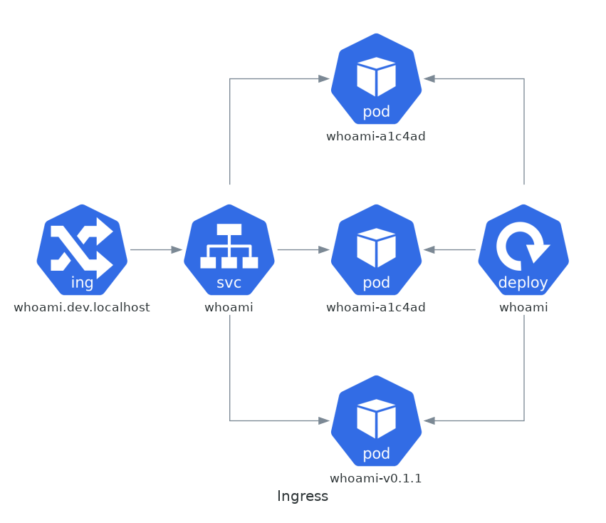
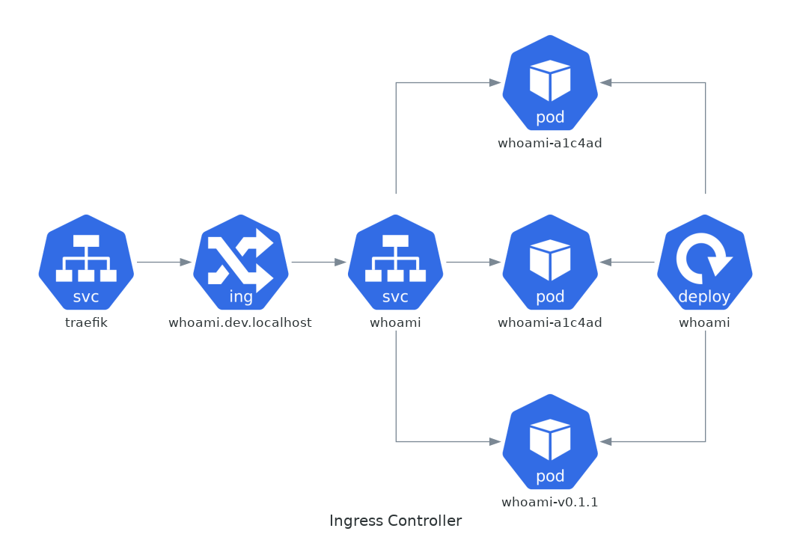
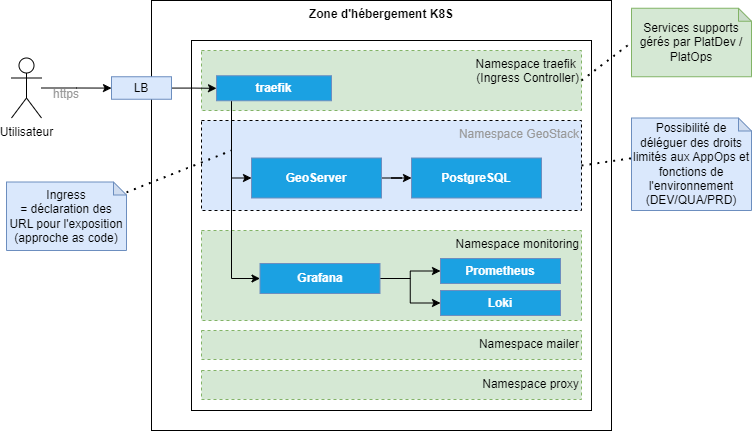

# DevOps avec Kubernetes

- [Introduction](#introduction)
- [Principe de fonctionnement](#principe-de-fonctionnement)
- [Découvrir Kubernetes par la pratique](#découvrir-kubernetes-par-la-pratique)
- [Les principaux concepts](#les-principaux-concepts)
- [Le déploiement de GeoStack avec Kubernetes](#le-déploiement-de-geostack-avec-kubernetes)
- [Intérêt de Kubernetes](#intérêt-de-kubernetes)
- [Que manque-t'il à ce stade?](#que-manque-til-à-ce-stade)

---

## Introduction

### L'orchestration de conteneurs

Il existe plusieurs solutions d'**orchestration de conteneurs** permettant :

- L'automatisation de la gestion des conteneurs (ex : redémarrage en cas de problème)
- L'automatisation des **déploiements sans interruption**.
- La **mise en réseau** des conteneurs pour l'**exécution sur plusieurs hôtes**.
- L'automatisation de la **mise à l'échelle**.

---

## Introduction

### Swarm

Nous soulignerons l'existence de la solution d'orchestration [Swarm](https://docs.docker.com/engine/swarm/) qui est intégrée à docker et qui permettrait par exemple de :

- [Créer un cluster avec les machines vagrantbox](https://docs.docker.com/engine/swarm/swarm-tutorial/create-swarm/)
- [Déployer GeoStack sous forme d'un service sur ce cluster](https://docs.docker.com/engine/swarm/swarm-tutorial/deploy-service/)

Nous noterons que le développement de [Swarm](https://docs.docker.com/engine/swarm/) a principalement amené l'ajout d'un réseau de type "overlay" à Docker pour la communication des conteneurs entre plusieurs machines.

---

## Introduction

### Kubernetes

Nous allons plutôt nous concentrer sur **Kubernetes** qui est une référence en matière d'orchestration de conteneurs et qui bénéficie d'un riche écosystème incluant des **solutions de plus haut niveau d'abstraction** ("serverless") qui ne seront pas présentées dans ce cours :

- [KNative - Serverless and Event Driven Applications](https://knative.dev/docs/)
- [OpenFaaS - Serverless Functions, Made Simple](https://www.openfaas.com/)


---

## Principe de fonctionnement

### L'API de Kubernetes (1/3)

Kubernetes met à disposition une [API de contrôle de l'exécution des conteneurs à l'échelle d'un cluster](https://kubernetes.io/docs/concepts/overview/components/) avec :

- Une **approche déclarative** où l'utilisateur spécifie les **objets** à créer en YAML (ou JSON)
- Des **concepts plus riches et plus nombreux** que l'API docker

---

## Principe de fonctionnement

### L'API de Kubernetes (2/3)

Nous verrons que **cette API est centrale dans l'écosystème Kubernetes** :

- Elle donne un cadre pour **l'authentification** et **la gestion des droits** (RBAC).
- Elle permet l'**introspection** (découverte de configuration) et la **réflexion** (interfaces graphiques, [opérateurs en charge de déployer des applications](https://operatorhub.io/),...)
- Elle est **extensible** (les applications peuvent définir leurs propres types d'objet)

---

## Principe de fonctionnement

### L'API de Kubernetes (3/3)

Cette API sera centrale pour l'administration d'un cluster Kubernetes :

<div class="left illustration">



Administration VM vs K8S

</div>

<div class="right">

Par rapport à l'administration des VM :

- Le client [kubectl](https://kubernetes.io/docs/reference/kubectl/) remplacera `ssh`.
- Il sera possible de distinguer les objets gérés par les **administrateurs du cluster** de ceux gérés par les **administrateurs des applications métiers**.

</div>

---

## Principe de fonctionnement

### Le plan de contrôle et les noeuds

Le **plan de contrôle** (*control-plane*) héberge les composants relatifs à la gestion du cluster dont :

- L'API Kubernetes (`kube-apiserver`)
- La base de données clé/valeur de l'API (`etcd`)

En production, les conteneurs applicatifs s'exécuteront sur des **noeuds** (`nodes`) distincts de ceux hébergeant les composants du plan de contrôle.

> Voir [kubernetes.io - Kubernetes Components](https://kubernetes.io/docs/concepts/overview/components/) pour un schéma d'architecture et des explications plus détaillées.

---

## Principe de fonctionnement

### Un modèle réseau ouvert par défaut

<div style="font-size:0.8em">

Avec docker, pour que deux conteneurs puissent communiquer, il faut s'assurer qu'ils partagent le même réseau.

Avec Kubernetes, nous aurons :

- Un **modèle réseau ouvert par défaut** pour la communication au sein du cluster (1).
- La **possibilité de restreindre les communications réseaux** avec un concept dédié : [NetworkPolicy](https://kubernetes.io/docs/concepts/services-networking/network-policies/).

Dans ce cours, nous nous limiterons à noter que **l'utilisation d'un pare-feu classique ne permettra pas de maîtriser finement les flux réseaux** (2).

> (1)Voir [kubernetes.io - The Kubernetes network model](https://kubernetes.io/docs/concepts/services-networking/#the-kubernetes-network-model) et [youtube.com - Understanding Kubernetes Networking. Part 2: POD Network, CNI, and Flannel CNI Plug-in](https://www.youtube.com/watch?v=U35C0EPSwoY) pour des explications plus détaillées.
> 
> (2) Un pare-feu externe au cluster ne verra que les IP des noeuds, il ne sera pas possible de raisonner à l'échelle des services pour imposer par exemple l'utilisation d'un proxy sortant.

</div>

---

## Découvrir Kubernetes par la pratique

### Installation du client

Pour communiquer avec un cluster, nous installerons le client [kubectl](https://kubernetes.io/fr/docs/tasks/tools/install-kubectl/) qui nous permettra de communiquer avec l'API Kubernetes en ligne de commande. 

---

## Découvrir Kubernetes par la pratique

### Création d'un cluster de développement

<div style="font-size:0.9em">

Il existe différents outils permettant d'installer un environnement de développement Kubernetes :

- [K3S](https://k3s.io/) de Rancher.
- [MicroK8S](https://microk8s.io/) de Canonical (Ubuntu).
- [Minikube](https://kubernetes.io/fr/docs/setup/learning-environment/minikube/)
- [Kind (Kubernetes in docker)](https://kind.sigs.k8s.io/) (à éviter pour débuter)

Nous traiterons l'**installation de K3S avec Ansible sur les VM vagrantbox** à l'aide du dépôt [mborne/k3s-deploy](https://github.com/mborne/k3s-deploy#k3s-deploy) pour faire le lien avec les parties précédentes.

> Nous pourrions [installer K3S sur une simple VM](https://k3s.io/). Vous pourrez aussi tester [mborne/docker-devbox - kind - quickstart.sh](https://github.com/mborne/docker-devbox/tree/master/kind#readme) quand vous serez familiarisé à Kubernetes.

</div>

---

## Découvrir Kubernetes par la pratique

### Lister les noeuds

En premier contact, nous pourrons :

- Configurer `kubectl` pour utiliser le cluster déployé sur les machines vagrantbox :

```bash
# Copier l'aide affichée par k3s-deploy :
export KUBECONFIG=/home/formation/k3s-deploy/.k3s/k3s.yaml
```

- Lister les noeuds à l'aide des commandes suivantes :

```bash
# Information sur le cluster
kubectl cluster-info
# Lister les noeuds
kubectl get nodes
```

---

## Découvrir Kubernetes par la pratique

### Et maintenant?

Nous allons maintenant pouvoir **découvrir progressivement les principaux concepts de Kubernetes à l'aide d'exemples**.

---

## Les principaux concepts

### Les Pods

Les [Pods](https://kubernetes.io/docs/concepts/workloads/pods/) sont la plus petite unité d'exécution gérée par Kubernetes. Ils sont porteurs des spécifications pour l'exécution d'un ou plusieurs conteneurs qui partagent sur un même Pod :

- Le même réseau (communication en localhost)
- Le même stockage (accès aux volumes)

Nous traiterons les exemples [mborne/k8s-exemples - Pods](https://github.com/mborne/k8s-exemples#pod) en faisant le lien avec [les exemples de prise en main de docker](https://github.com/mborne/docker-exemples#readme) pour nous familiariser avec ce concept.

> Nous ne détaillerons pas les cas d'utilisations des Pod avec plusieurs conteneurs (sidecar, ambassador, adapter) et des conteneurs d'initialisation (ex : télécharger des données au démarrage, retarder le démarrage d'un service,...)

---

## Les principaux concepts

### Les charges de travail (1/2)

En pratique, les [Pods](https://kubernetes.io/docs/concepts/workloads/pods/) ne sont pas créés manuellement. Nous définissons plutôt des [charges de travail (*workloads*)](https://kubernetes.io/docs/concepts/workloads/) adaptées à la nature de l'application pour créer les Pods :

- Un [Deployment](https://kubernetes.io/docs/concepts/workloads/controllers/deployment/) pour un **service sans état** (ex : [whoami](schema/whoami-deployment.png))
- Un [StatefulSet](https://kubernetes.io/docs/concepts/workloads/controllers/statefulset/) pour **un service avec état** (ex : [PostgreSQL](schema/postgres-statefulset.png) où chaque Pod disposera de son propre stockage)
- Un [DaemonSet](https://kubernetes.io/docs/concepts/workloads/controllers/daemonset/) pour exécuter **un Pod par noeud** (ex : [fluent-bit](https://fluentbit.io/) pour la collecte des logs)

Nous traiterons le premier cas avec [mborne/k8s-exemples - Création de plusieurs Pod whoami à l'aide d'un Deployment](https://github.com/mborne/k8s-exemples#deployment).

---

## Les principaux concepts

### Les charges de travail (2/2)

En complément, nous soulignerons aussi la possibilité de définir :

- Des [Job](https://kubernetes.io/docs/concepts/workloads/controllers/job/) pour des **tâches ponctuelles**.
- Des [CronJob](https://kubernetes.io/docs/concepts/workloads/controllers/cron-jobs/) pour des **tâches périodiques**.

Nous traiterons la [création d'un Job calculant 2000 décimales de PI](https://kubernetes.io/docs/concepts/workloads/controllers/job/).

---

## Les principaux concepts

### Le concept de Service (1/2)

En première approche, un [Service](https://kubernetes.io/docs/concepts/services-networking/service/) pourra être vu comme un reverse proxy devant les Pods :

<div class="left illustration">



</div>

<div class="right">

Nous traiterons [mborne/k8s-exemples - Création d'un service whoami devant ces Pods](https://github.com/mborne/k8s-exemples#service) et constaterons qu'**un service offre un point d'accès stable à l'un des Pod** dans le cluster (ex : `http://whoami`)

</div>

---

## Les principaux concepts

### Le concept de Service (2/2)

<div style="font-size: 0.95em">

Nous remarquerons qu'il existe [plusieurs types de services](https://kubernetes.io/fr/docs/concepts/services-networking/service/#publishing-services-service-types) dont :

- `ClusterIP` rendant le **service accessible dans le cluster** (type par défaut)
- `LoadBalancer` permettant de demander l'**exposition sur une IP publique**.
- `NodePort` permettant l'**exposition via un port sur un noeud (<u>à éviter</u>**)

Nous traiterons [mborne/k8s-exemples - Exposition du service whoami sur une IP publique](https://github.com/mborne/k8s-exemples#service) pour accéder au service depuis notre machine sur une IP publique en exploitant le type `LoadBalancer` (1).

> (1) K3S simulera la publication en exposant le service sur les machines vagrantbox. Dans d'autres contextes (ex : Google Kubernetes Engine), une IP publique serait affectée pour notre service avec routage du traffic vers le service Kubernetes.

</div>

---

## Les principaux concepts

### Le concept de Namespace

<div style="font-size: 0.95em">

Les [Namespace](https://kubernetes.io/docs/concepts/overview/working-with-objects/namespaces/) permettent d'isoler des groupes de ressources définies dans un même cluster. Ils permettent d'héberger et de **cloisonner plusieurs applications dans un même cluster** (*Namespace as a service*).

Nous traiterons [mborne/k8s-exemples - Namespace](https://github.com/mborne/k8s-exemples#namespace) pour **inspecter les namespaces** existants dont :

- "default" dans lequel nous avons travaillé jusque là sans le préciser
- "kube-system" où nous trouverons un service assurant la résolution DNS (ex : pour l'appel à `http://whoami` testé précédemment)

Nous verrons **comment créer et utiliser un namespace dédié pour l'application whoami**.

</div>

---

## Les principaux concepts

### Le concept Ingress (1/3)

Le concept [Ingress](https://kubernetes.io/docs/concepts/services-networking/ingress/) permettra de **spécifier l'exposition d'un service en HTTP/HTTPS**.

<div class="left">

Ci contre, nous spécifions l'exposition du service `"whoami"` sur le domaine `"whoami.dev.localhost"` :

</div>

<div class="right illustration">



</div>

---

## Les principaux concepts

### Le concept Ingress (2/3)

L'exposition des ressources [Ingress](https://kubernetes.io/docs/concepts/services-networking/ingress/) sera prise en charge par un [*Ingress Controller*](https://kubernetes.io/docs/concepts/services-networking/ingress-controllers/).

<div class="left">

Nous trouverons [plusieurs implémentations](https://kubernetes.io/docs/concepts/services-networking/ingress-controllers/#additional-controllers) dont une implémentation [Traefik](https://github.com/mborne/docker-devbox/tree/master/traefik#usage-with-kubernetes) qui est installée par défault avec K3S.

</div>

<div class="left illustration">



Illustration de Traefik en tant qu'Ingress Controller

</div>

---

## Les principaux concepts

### Le concept Ingress (3/3)

Nous traiterons [mborne/k8s-exemples - Ingress](https://github.com/mborne/k8s-exemples#ingress) pour :

- Vérifier l'installation de Traefik traitée par K3S
- **Exposer le service whoami sous forme d'une URL** à l'aide d'une ressource Ingress.

---

## Les principaux concepts

### Le stockage et les volumes

<div style="font-size: 0.95em">

Nous retrouverons le concept de [Volume](https://kubernetes.io/docs/concepts/storage/volumes/) repris à Docker. Nous trouverons toutefois de nombreux concepts complémentaires permettant :

- Le support d'un plus **grand nombre de systèmes de stockage**.
- De traiter **différents cas d'utilisation d'utilisation** avec une distinction entre :
  - [Les volumes persistants (PersistentVolume)](https://kubernetes.io/docs/concepts/storage/persistent-volumes/)
  - [Les volumes éphémères](https://kubernetes.io/docs/concepts/storage/ephemeral-volumes/) (ex : [emptyDir](https://kubernetes.io/docs/concepts/storage/volumes/#emptydir) pour un dossier de cache)
  - [Les volumes projetés](https://kubernetes.io/docs/concepts/storage/projected-volumes/) (ex : [configMap](https://kubernetes.io/docs/concepts/storage/volumes/#configmap) pour un fichier de configuration)

Nous survolerons l'annexe [Kubernetes - les volumes et le stockage](annexe/kubernetes/stockage.html) pour constater que **Kubernetes offre de nombreuses possibilités en matière de stockage** mais que **c'est un sujet complexe**.

</div>

---

## Les principaux concepts

### Les opérateurs

Pour les déploiements complexes, nous trouverons des **opérateurs** qui seront chargés de **déployer des applications complexes**.

Par exemple, nous pourrons utiliser [CloudNativePG](https://cloudnative-pg.io/) pour déployer un cluster PostgreSQL (voir [postgis-cluster.yaml](https://github.com/mborne/docker-devbox/blob/master/cnpg/manifest/postgis-cluster.yaml)).

---

## Le déploiement de GeoStack avec Kubernetes

### Principe

Nous allons reprendre le déploiement de GeoStack :

- Nous utiliserons [CloudNativePG](https://cloudnative-pg.io/) pour simplifier l'installation de PostgreSQL.
- Nous inspecterons les YAML rédigés pour déployer GeoServer sans traitement de la scalabilité (1).

Voir [mborne/geostack-deploy - k8s - Déploiement de GeoStack avec Kubernetes](https://github.com/mborne/geostack-deploy/blob/master/k8s/README.html)

> (1) Vous pourrez inspecter [geoserver-cloud](https://github.com/geoserver/geoserver-cloud?tab=readme-ov-file#geoserver-cloud) qui est un cas d'école en matière de **décomposition d'un monolythe en micro-services pour faciliter le traitement de la scalabilité** et pour lequel l'article [camptocamp.com - Vers une meilleure intégration de GeoServer dans une infrastructure cloud](https://camptocamp.com/fr/actualites-evenements/integration-de-geoserver-dans-une-infrastructure-cloud) documente les travaux correspondants.

---

## Intérêt de Kubernetes

### Un cadre standardisé pour la zone d'hébergement

<div class="left">

En résumé, Kubernetes offre des **concepts standardisés pour chacun des éléments à configurer dans la zone d'hébergement**.

</div>

<div class="right illustration">



Exemple d'architecture de zone d'hébergement K8S

</div>

---

## Intérêt de Kubernetes

### Un cadre pour la création d'un écosystème

L'API extensible amène un cadre pour le développement de composants réutilisables sur différentes instances Kubernetes :

- [Kubernetes Dashboard](https://github.com/kubernetes/dashboard#kubernetes-dashboard)
- [Prometheus](https://prometheus.io/) / [Grafana](https://grafana.com/grafana/dashboards/) / [Loki](https://github.com/grafana/loki#readme) pour l'**observabilité**
- [ArgoCD](https://argo-cd.readthedocs.io/en/stable/), [GitLab-CI](https://docs.gitlab.com/ee/user/clusters/agent/ci_cd_workflow.html),... pour l'**orchestration des déploiements**
- [cert-manager](https://cert-manager.io/) pour la **gestion des certificats**
- ...

---

## Intérêt de Kubernetes

### Un cadre complet pour *infrastructure as code*

Avec une zone d'hébergement IAAS, une approche IaC partielle était possible mais limitante.

Avec Kubernetes, nous pouvons **gérer as code** :

- Le **déploiement et la configuration des services techniques** (nous pouvons donc gérer efficacement le proxy et les domaines autorisés à l'aide de pull-request).
- La **configuration du load-balancer (Ingress)** (nous pouvons donc déployer une nouvelle version sans interruption de service).
- La configuration du **pare-feu (NetworkPolicy)** (nous pouvons donc gérer plus finement les flux réseaux sans retarder les déploiements)
- ...

---

## Intérêt de Kubernetes

### Un cadre pour le partage des responsabilités

<div style="font-size:0.9em">

Avec une **zone d'hébergement IAAS**, il était difficile d'aller loin qu'une approche du style suivant induisant des **conflits de gestion** :

- Les PlatOps sont "sudoers" sur toutes les VM
- Les AppOps sont "sudoers" sur les VM applicatives

Avec **Kubernetes**, la présence d'une API REST permet de **gérer beaucoup plus finement les droits as code** :

- Les AppOps disposent de droits uniquement sur leurs namespaces applicatifs
- Les AppOps disposent de droits limités sur les différents types d'objet Kubernetes dans ces namespaces (ex : possibilité de consulter les règles de pare-feu (NetworkPolicy) sans possibilité de les modifier)

</div>

---

## Que manque-t'il à ce stade?

### Kubernetes n'est pas une solution clé en main

A ce stade, nous soulignerons que **Kubernetes n'est pas une solution offrant une zone d'hébergement clé en main**. Il faudra par exemple **déployer, configurer et exploiter des services techniques** (ex : Ingress Controller, Prometheus, Grafana...).

---

## Que manque-t'il à ce stade?

### Les distributions et offres managées

Nous pourrons **limiter les efforts sur certains points** avec des **distributions plus riches** (ex : Rancher, VMWare Tanzu,...) ou en ayant recours à **Kubernetes en mode SaaS** (Managed Kubernetes Service chez OVH, Google Kubernetes Engine,...) mais :

- **Les efforts seront variables selon le choix** (ex : fluent-bit sera déployé automatiquement pour alimenter Google Cloud Logging avec GKE)
- **Il restera toujours des choix à faire en matière de gestion des droits** (ex : sur quel environnement donner des droits aux DEV?), des **utilisateurs à gérer** et **un système et des coûts à surveiller**.

---

## Que manque-t'il à ce stade?

### Sécuriser l'exécution des conteneurs

Pour sécuriser l'exécution des conteneurs, il nous resterait à [configurer des options de sécurité sur les conteneurs](https://kubernetes.io/docs/concepts/security/pod-security-standards/).

Or, l'activation de certaines options n'est pas indolore au niveau des applications. Par exemple, pour **exécuter des conteneurs en non root**, il faut :

- **Utiliser des ports non privilégiés** (utiliser le port 80 posera problème).
- **Gérer proprement les droits sur les fichiers dans le conteneur**.

---

## Que manque-t'il à ce stade?

### Maîtriser la consommation des ressources systèmes (1/2)

Il nous resterait aussi à [spécifier les réservations et limites RAM et CPU des conteneurs](https://kubernetes.io/docs/concepts/configuration/manage-resources-containers/#example-1) pour :

- Permettre la mise en oeuvre de l'**autoscalling sur les noeuds**.
- **Éviter qu'un service consomme toutes les ressources CPU et RAM d'un noeud**.

---

## Que manque-t'il à ce stade?

### Maîtriser la consommation des ressources systèmes (2/2)

Il serait aussi nécessaire de **s'assurer qu'un Pod ne provoque pas un full sur un noeud** par exemple en :

- Imposant la déclaration de volumes pour le stockage local (`readOnlyRootFilesystem: true`).
- Imposant la déclaration de limites via la mise en oeuvre des quotas sur le stockage local.

---

## Que manque-t'il à ce stade?

### Kubernetes n'est pas magique!

Kubernetes offre un cadre permettant la cohabitation d'applications conteneurisées (limites de consommation de ressources, options de sécurité,...).

Il est toutefois du ressort de l'utilisateur d'exploiter ce cadre en **respectant un ensemble de [bonnes pratiques](annexe/docker/bonnes-pratiques.html) dans la création et l'exécution des conteneurs** pour profiter d'un bon niveau de sécurité et d'un haut niveau de disponibilité (1).

> (1) NB : Les mécanismes de redémarrage automatique des Pods en cas de problème limiteront les effets de certains types de problème (ex : atteinte limite RAM). Il faudra intervenir pour d'autres (ex : full sur un noeud)

---

## Que manque-t'il à ce stade?

### Kubernetes ne produit pas des conteneurs prêt pour la production!

En substance, **Kubernetes ne libérera pas les DEV de la nécessité de produire des conteneurs "prod-ready"**.

L'utilisation de Kubernetes imposera plutôt une **bonne maîtrise de la consommation RAM** et une **rigueur dans la gestion des données**.

---

## Que manque-t'il à ce stade?

### Kubernetes n'est pas la solution à tous les problèmes

Il convient aussi de noter que :

- **Déployer et maintenir des applications "Stateful"** telles des bases de données **en environnement Kubernetes n'est pas trivial** et demandera une **maîtrise du stockage** avec Kubernetes.
- **Kubernetes est une solution bas niveau** qui sera **moins efficace qu'une offre PaaS ou SaaS pour déployer certaines applications** (ex : CMS, site statique,...).

Nous allons à ce titre prendre un peu de recul dans la partie [DevOps dans le cloud](cloud.html) et aborder la possibilité d'hybrider les solutions.

