# Les origines de DevOps

* La démocratisation d'internet
* Les géants du web
* L'agilité dans les développements
* L'automatisation des tests sur le code
* La gestion des sources
* L'intégration continue
* La virtualisation
* La démocratisation du cloud
* La diversification des offres cloud
* Les limites de l'exploitation traditionnelle
* La naissance du terme DevOps

---

## La démocratisation d'internet

La fin des années 90 marque le début de la démocratisation d'internet :

    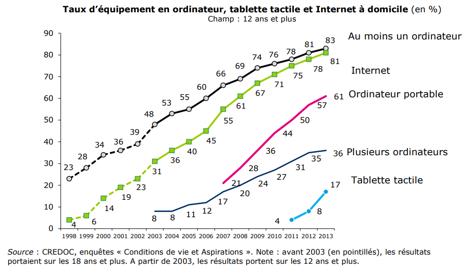

Le nombre de clients potentiels pour une application en ligne suivra cette courbe.

---

## Les géants du web (1/3)

Les **[géants du web](https://fr.wikipedia.org/wiki/G%C3%A9ants_du_Web)** naîtront sur cette période et feront rapidement face aux requêtes de **plusieurs millions d'utilisateurs** :

* Amazon (1994)
* Netflix (1997)
* Google (1998)
* Facebook (2004)
* ...

---

## Les géants du web (2/3)

Ils répondront par de nouvelles approches au niveau des traitements (ex : [MapReduce (2004)](https://fr.wikipedia.org/wiki/MapReduce)) et du stockage (ex : [stockage NoSQL](https://fr.wikipedia.org/wiki/NoSQL)) permettant la **scalabilité horizontale** :

    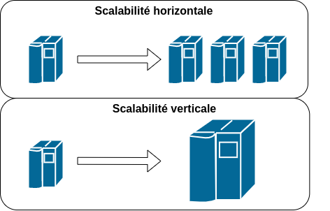

Nous soulignerons qu'au niveau de développement de service web, cette approche conduira à utiliser des [reverse proxy assurant un rôle de répartiteur de charge](annexe/lb-rp.html).

---

## Les géants du web (3/3)

Ces acteurs seront aussi des pionniers en matière de DevOps en répondant avec **une nouvelle approche dans la gestion des infrastructures**. 

Le rôle de [Site Reliability Engineer (SRE)](https://sre.google/books/) posé par Google en 2003 pour assurer un haut niveau de disponibilité des services en **collaboration étroite avec les développeurs** sera précurseur en matière de DevOps.

---

## L'agilité dans les développements (1/2)

La démocratisation d'internet et des applications en réseau se traduira aussi par **la possibilité de livrer à moindre frais des évolutions et des correctifs**

    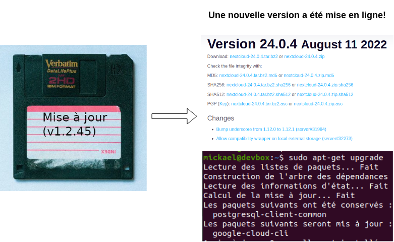

---

## L'agilité dans les développements (2/2)

La publication du **[manifeste agile](https://manifesteagile.fr/) en 2001** marquera un tournant dans les méthodes de développement qui exploitera pleinement la possibilité de livrer à moindre frais.

En effet, l'agilité inclura entre autre de :

* **Livrer rapidement et régulièrement** une nouvelle version de l'application.
* **Faire travailler ensemble** les personnes en charge du **métier ou des affaires** et les personnes en charge de la **réalisation** au quotidien tout au long du projet.

---

## La gestion des sources (1/2)

L'agilité des développements imposera d'**améliorer les outils et méthodes de gestion du code source des applications** pour faciliter la **collaboration** et mieux **gérer l'historique des évolutions et corrections**.

Nous nous souviendrons des heures sombres où l'utilisation d'un gestionnaire de code source n'était pas une pratique répandue :

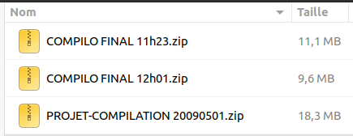

> La gestion de l'historique d'un projet d'étudiant avant que l'utilisation d'un gestionnaire de code source soit enseignée à l'ENSG.

---

## La gestion des sources (2/2)

Nous soulignerons l'évolution des **gestionnaires de code source (*SCM*)** avec :

* La gestion d'**historique client/serveur** : CVS (1990), SVN (2000)
* La gestion d'**historique décentralisée** : **GIT** (2005)
* L'introduction du **concept de *pull-request*** avec GitHub (2008)

Nous tâcherons de mesurer l'apport du concept de **pull-request** en terme de **traçabilité** par rapport aux **processus de validation** traditionnels. Il motivera l'utilisation des SCM à d'autres cas d'utilisation (gestion des infrastructures, gestion de la documentation,...)

---

## L'automatisation des tests sur le code

Livrer rapidement et régulièrement sera **incompatible** avec le fait procéder à de longues **recettes manuelles** pour **éviter l'introduction de bug**.

L'agilité se déclinera donc en plusieurs méthodes de développement qui inciteront à **réduire le risque de régression** à l'aide de **tests unitaires et fonctionnels**.

On citera par exemple **[Test-driven development (TDD)](https://en.wikipedia.org/wiki/Test-driven_development)** formalisée **en 2003** par Kent Beck où l'idée est de **commencer par écrire les tests unitaires**.

---

## L'intégration continue

Les outils d'**intégration continue** tels [Hudson sorti en 2005](https://en.wikipedia.org/wiki/Hudson_(software)) (forké et renommé en [Jenkins](https://www.jenkins.io/)) gagneront naturellement en popularité. Ils seront utilisés entre autre pour :

* **Centraliser l'exécution des tests** (et s'assurer qu'ils sont bien exécutés)
* Présenter pour tous les **rapports d'exécution des tests**
* **Produire des livrables** à déployer (archive zip/tar, paquet .deb pour debian, .rpm pour centos, installeur windows,...)

    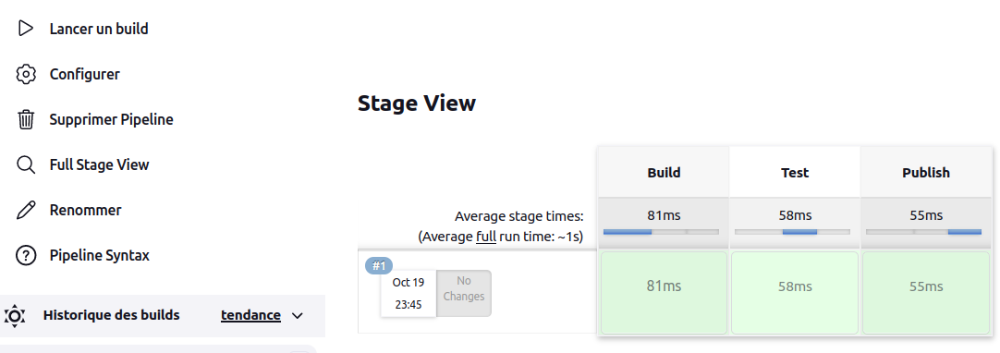
     
    <a href="https://www.jenkins.io/doc/book/pipeline/jenkinsfile/#creating-a-jenkinsfile">(www.jenkins.io - Creating a Jenkinsfile)</a>

---

## La gestion des sources (2/2)

Il sera très rapidement tentant d'**exécuter les tests avant d'accepter des demandes de modification du code (*pull request*)**. Des solutions d'**intégration continue** telles [GitHub actions](https://github.com/features/actions) et [GitLab-CI](https://docs.gitlab.com/ee/ci/) seront donc **intégrées aux gestionnaires de code source** quelques années plus tard. 

    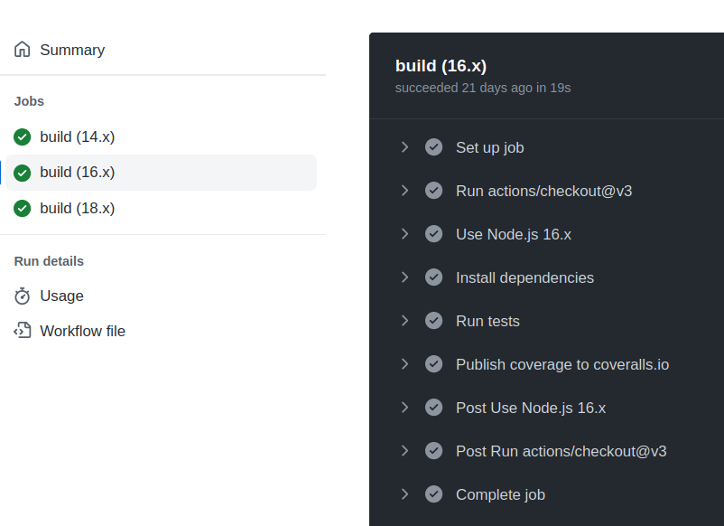
     
    <a href="https://github.com/mborne/node-extract/actions">(mborne/node-extract - actions)</a>

---
## La virtualisation (1/3)

### La popularisation de la virtualisation

La virtualisation gagnera en popularité auprès des développeurs grâce à la sortie de logiciel gratuit tels [VirtualBox](https://www.virtualbox.org/) supportant les architectures x86 :

    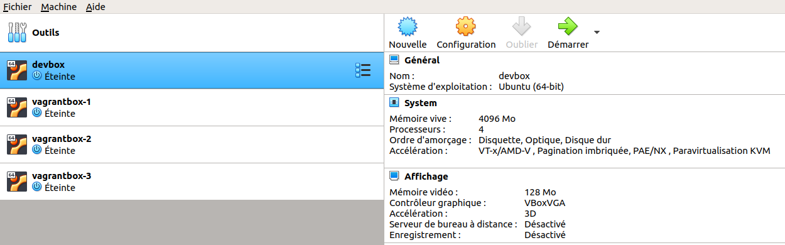
     
    (Illustration de l'utilisation de VirtualBox pour construire un environnement de développement)

> Voir [Virtualisation - Définition et Explications](https://www.techno-science.net/glossaire-definition/Virtualisation-page-3.html)

---
## La virtualisation (2/3)

### Les différents types d'hyperviseurs

Pour la culture, nous soulignerons qu'il existe différents types d'hyperviseurs :

    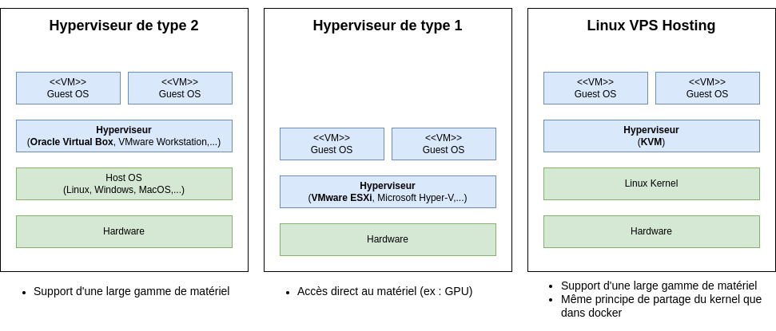

---
## La virtualisation (3/3)

### La virtualisation des applications

A l'usage, nous mémoriserons que l'**utilisation de VM permet de faire abstraction sur l'infrastructure** :

    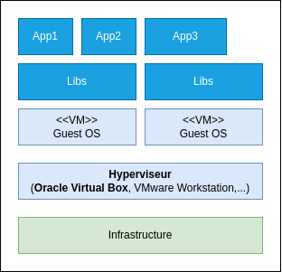

> Nous soulignerons qu'il est possible d'héberger **plusieurs applications sur une même VM** mais nous constaterons que ceci implique un **partage des bibliothèques systèmes** posant des problèmes de compatibilité de version (python 2/3, PHP 5.6/7.4/8.1,...)

---

## La démocratisation du cloud (1/3)

### Un coût d'entrée faible pour la scalabilité

En 2006, Amazon lancera deux services qui vont contribuer à populariser le concept d'informatique en nuage :

* [Amazon S3](https://en.wikipedia.org/wiki/Amazon_S3) pour le stockage de données.
* [Amazon Elastic Compute Cloud (EC2)](https://en.wikipedia.org/wiki/Amazon_Elastic_Compute_Cloud) pour l'exécution d'application.

Avec ces services :

* Disposer d'une infrastructure de stockage et de calcul capable de s'**adapter à la charge** n'est plus réservée à quelques grands groupes.
* La **facturation à la consommation** donne l'opportunité aux entreprises de taille modeste de **lancer un nouveau service qui ne sera pas victime de son succès**.

---

## La démocratisation du cloud (2/3)

### Une conception permettant l'automatisation

Au niveau d'AWS, Jeff BEZOS posera une règle d'architecture importante : **Toutes les communications entre les projets doivent passer par l'exposition et l'utilisation d'API en réseau** ( c.f. [The API Mandate: How a mythical memo from Jeff Bezos changed software forever](https://konghq.com/blog/api-mandate) ).

Ceci jouera beaucoup dans :

* La capacité d'AWS à **accroître efficacement son offre de service** (couplage faible, interfaces clairement définies,...)
* La capacité des clients à **automatiser l'utilisation des ressources mises à disposition par AWS** (des appels à un service étant plus facilement automatisable que des clics dans une interface graphique)

> NB : Cette règle s'applique aux <u>communications entre les services</u> (s'efforcer de construire toutes ses applications sur la base d'API REST/JSON développées par d'autres serait assez limitant...)

---

## La démocratisation du cloud (3/3)

### La généralisation d'IaaS

Plus largement, le principe de mise à disposition d'une **API permettant de contrôler une infrastructure virtualisée** se généralisera par la suite sous le nom **IaaS (*Infrastructure as a Service*)** :

    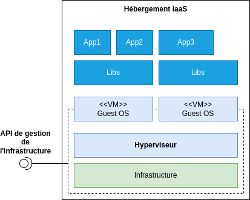

> On notera que la VM est généralement initialisé par l'hébergeur sur la base d'un catalogue offrant plusieurs OS mais les mises à jour et installations sont ensuite à la charge du client.

---

## La diversification des offres cloud

Les offres cloud se diversifieront assez rapidement avec une **prise en charge variables des différentes couches du système par les fournisseurs de service** :

    
    

    (Source : <a href="https://www.redhat.com/fr/topics/cloud-computing/iaas-vs-paas-vs-saas">www.redhat.com - IaaS, PaaS, SaaS : quelles sont les différences ?</a>)
    

---

## Les limites de l'exploitation traditionnelle (1/6)

### Une séparation stricte des rôles

A ce stade, les possibilités d'automatisation des déploiements sont là mais les méthodes héritées de l'**exploitation traditionnelle** se traduisent généralement par un **processus sacralisant un cloisonnement strict des rôles entre les DEV et les OPS**.

Il en résulte des situations où l'infrastructure est virtualisée et dotée d'une API permettant d'automatiser la gestion des VM sans que les DEV aient connaissance de cette possibilité.

---

## Les limites de l'exploitation traditionnelle (2/6)

### Une communication centrée sur des documents

On trouvera par exemple le processus suivant pour déployer une application :

    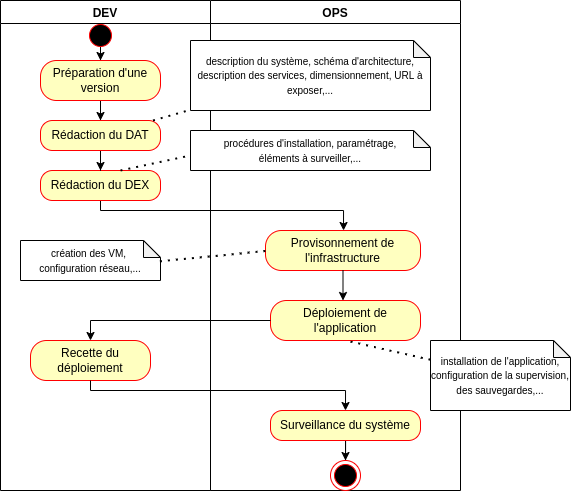

---

## Les limites de l'exploitation traditionnelle (3/6)

### Une approche en apparence parfaite!

* Les **développeurs** sont **déchargés des problématiques d'exploitation**
* Seuls des **administrateurs systèmes configurent le système** ([ce qui conforme à la PSSIE rédigée en 2014...](https://www.ssi.gouv.fr/entreprise/reglementation/protection-des-systemes-dinformations/la-politique-de-securite-des-systemes-dinformation-de-letat-pssie/))

**C'est oublier la [loi de Murphy](https://fr.wikipedia.org/wiki/Loi_de_Murphy)!**

---

## Les limites de l'exploitation traditionnelle (4/6)

### Cette approche empêche de livrer rapidement!

La **mise en production initiale** de l'application prendra facilement **1 mois** pour diverses raisons :

* Problème de **compréhension des documents**
* Problème de **complétude des documents**
* Problème d'**actualité des documents**
* Problème de **disponibilité** des équipes

Il en sera de même pour **chaque évolution induisant le moindre changement d'architecture** (ajout d'un paramètre, ajout d'un service support,...) ce qui laissera deux options :

* Conserver volontairement une **architecture non optimale**.
* **Regrouper de nombreuses transformations** dans une version majeure où la **livraison sera longue et risquée**.

---

## Les limites de l'exploitation traditionnelle (5/6)

### Une approche qui génère des problèmes en production!

Une **demande d'exploitation ou une procédure** est **mal comprise** ou **mal traduite en opérations** sans que l'expertise de chacun soit mise à contribution :

* **Les OPS** ne participant pas à la conception de l'application **ne peuvent avoir un regard critique et une compréhension des demandes** (une mise à jour devient une montée en version, une action demandée en QUALIFICATION est appliquée en PRODUCTION,...)
* **Les DEV** ne participant pas à la conception de l'infrastructure **n'exploitent pas le système de manière optimale** (utilisation du mauvais système de stockage, absence de compression, saturation de la bande passante,...)

---

## Les limites de l'exploitation traditionnelle (6/6)

### Une approche amenant à chercher un coupable plutôt qu'une solution!

La frontière entre les rôles se traduit humainement par une tendance des équipes DEV et OPS à **chercher à limiter leur responsabilité en cas de problème** avant de chercher à **éviter l'apparition de problèmes** voire à **corriger rapidement un problème**.

Typiquement, avant de chercher une solution :

* Il faut **prouver côté DEV que le problème n'est pas au niveau du code** pour que les OPS commencent à analyser la supervision et les logs.
* Il faut **prouver côté OPS que le problème est lié au code ou à la conception** pour que les DEV revoient leur copie.

> Voir la BD [www.commitstrip.com - Comment savoir si votre entreprise est DevOps?](https://www.commitstrip.com/fr/2015/02/02/is-your-company-ready-for-devops/?) qui résume bien la situation.

---

## La naissance du terme DevOps (1/2)

Le terme DevOps naîtra d'une prise de conscience sur ces problématiques :

* En 2008, une conférence permettra la rencontre entre l'organisateur d'une rencontre sur le thème **« Infrastructure Agile »** et un chef de projet Patrick Debois faisant face au manque de  **cohésion entre les équipes de développement d'applications et les équipes d'exploitation**
* En 2009, Patrick Debois contractera **développements (DEV)** et **opérations (OPS)** dans un hashtag pour annoncer la première [DevOpsDays](https://devopsdays.org/): **DevOps est né**.

> [devopssec.fr - L'histoire du DevOps](https://devopssec.fr/article/histoire-du-devops) aborde cette genèse plus en détail.

---

## La naissance du terme DevOps (2/2)

DevOps dépasse à ce titre la simple problématique de l'automatisation des déploiement. DevOps est avant tout un constat :

* Pour pouvoir **livrer régulièrement et fréquemment des applications** et **s'adapter à la charge**, il faut de **l'agilité dans la gestion des infrastructures**.
* Pour introduire de l'**agilité dans les infrastructures**, il faut un **rapprochement entre les activités de développement (DEV) et d'exploitation (OPS)**.
