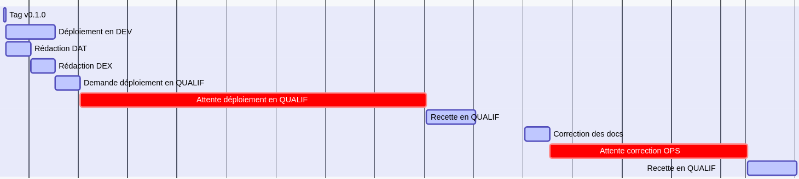
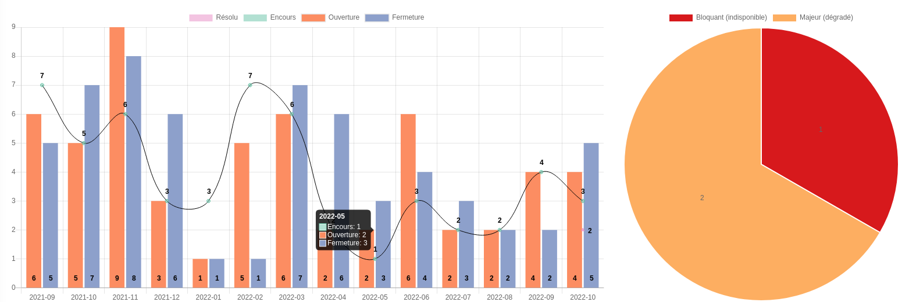
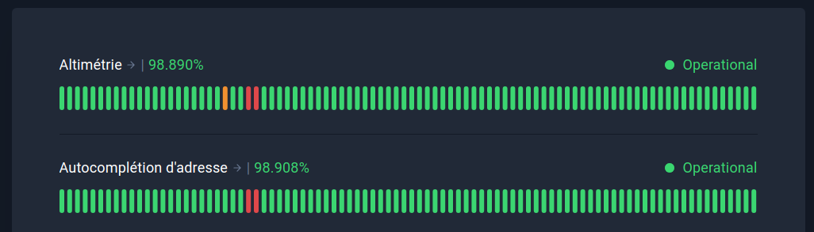
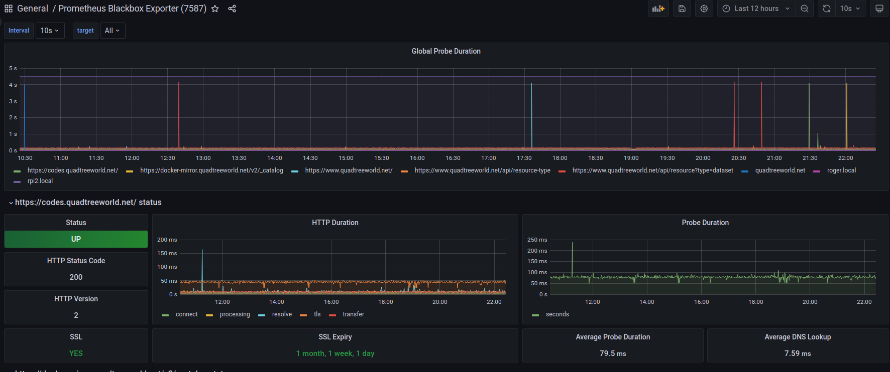
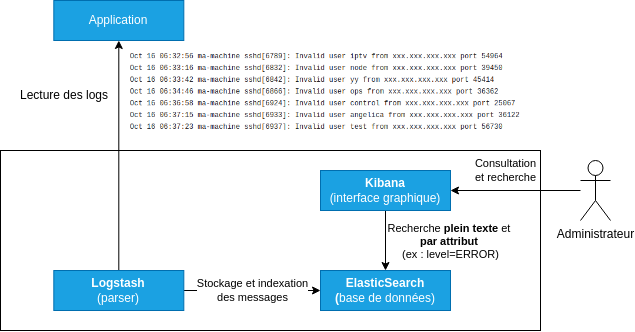
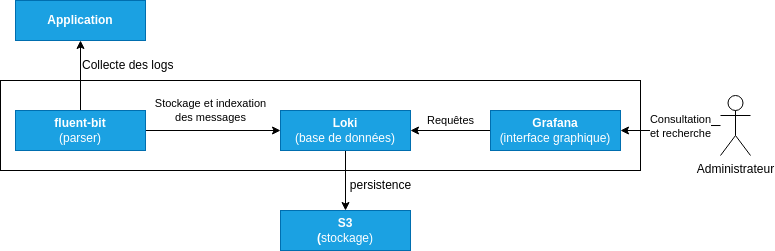

# Les principes de DevOps

- [Un objectif commun](#un-objectif-commun-12)
- [Un processus unifiant le DEV et l'OPS](#un-processus-unifiant-le-dev-et-lops-12)
- [Un processus sujet à l'amélioration continue](#un-processus-sujet-à-lamélioration-continue)
- [Le modèle CALMS](#le-modèle-calms)
- [Les métriques](#les-métriques)
- [L'observabilité](#lobservabilité)
- [Infrastructure as Code](#infrastructure-as-code)
- [GitOps](#gitops-13)
- [Docs as Code](#docs-as-code-14)
- [Everything as code!](#everything-as-code)

---

## Un objectif commun (1/2)

La séparation des DEV et des OPS conduit à des **objectifs distincts** :

- Les **DEV** veulent **livrer rapidement** des évolutions.
- Les **OPS** doivent avant tout **assurer la disponibilité**.

Il en résulte le **mur de la confusion**.

---

## Un objectif commun (2/2)

Pour remédier à cette situation, il sera impératif de replacer le produit et la création de valeur au centre en fixant un **objectif commun aux DEV et OPS** :

**Livrer rapidement des évolutions tout en assurant la disponibilité**

---

## Un processus unifiant le DEV et l'OPS (1/2)

Le partage de ce même objectif conduira à **unifier les processus de développement et de déploiement** :

---

## Un processus unifiant le DEV et l'OPS (2/2)

Nous reconnaîtrons dans ce processus la **roue de Deming** bien connue dans le **domaine de la qualité et l'agilité** :

(Source : <a href="https://commons.wikimedia.org/wiki/File:PDCA_Cycle_FR.svg">wikimedia.org - Michel Weinachter</a>)

Avec DevOps, il est principalement question de **ne pas avoir deux processus distincts pour le développement et le déploiement**.

---

## Un processus sujet à l'amélioration continue

Nous conviendrons que **la mise en oeuvre d'un tel processus prendra du temps** et qu'il sera **toujours perfectible**.

A ce titre, il conviendra de l'**améliorer en continu**.

---

## Le modèle CALMS

### Culture (1/5)

**La gestion des infrastructures est un sujet sensible** faisant l'objet d'un [cadre réglementaire (sécurité des systèmes d'information, RGPD,...)](https://cyber.gouv.fr/sinformer-sur-la-reglementation) et de recommandations (ex : [cyber.gouv.fr - Recommandations relatives à l'administration sécurisée des SI](https://cyber.gouv.fr/publications/recommandations-relatives-ladministration-securisee-des-si)).

Pour faire évoluer les pratiques et les processus, il faudra d'abord une compréhension partagée :

- De **ce qu'est l'agilité dans le développement** (et de ce que ça implique au niveau de l'exploitation, de la prévisibilité des coûts et des plannings de livraison des fonctionnalités...) 
- Des **limites des méthodes d'exploitation traditionnelle** (d'où les nombreuses slides)
- Des **goulots d'étranglement et améliorations possibles dans les processus de déploiement** en vigueurs
- ...

---

## Le modèle CALMS

### Culture (2/5)

Avant de cibler une **infrastructure agile**, il faudra être nombreux à constater un problème quand :

- **La livraison d'une application** avec une simple mise à jour des dépendances **prend des jours** (cas récent : [faille Log4Shell](https://fr.wikipedia.org/wiki/Log4Shell))
- La **procédure de déploiement n'est pas à jour**
- L'ajout d'une VM pour **faire face à un pic de charge est impossible** (5j pour obtenir la machine, 5j pour configurer le [load balancer](annexe/lb-rp.html),...)
- ...

---

## Le modèle CALMS

### Culture (3/5)

En pratique, s'orienter vers la méthode DevOps sera délicat sans une **politique globale permettant l'agilité au niveau de l'entreprise**. Sans entrer dans les détails :

- Il sera difficile d'impliquer les DEV dans l'exploitation avec une **logique de projet où le travail s'arrête à la mise en production**.
- Il sera **difficile d'identifier les problèmes et améliorations avec des projets gérés avec des méthodes hétérogènes** (Excel, JIRA, Teams, Redmine, issues GitHub/GitLab, voire par mail...)
- Il deviendra aussi **difficile de contacter efficacement des DEV et des OPS pour les traiter** après arrêt de l'ajout de fonctionnalités.

---

## Le modèle CALMS

### Culture (4/5)

Concrètement, il faudra aller [au-delà de Microsoft Office Excel pour la gestion de projets (support.microsoft.com)](https://support.microsoft.com/fr-fr/office/au-del%C3%A0-de-microsoft-office-excel-pour-la-gestion-de-projets-b68caffe-6552-4764-bc53-9107e12d3e22) et revoir [la gestion du cycle de vie des applications (ALM)](https://www.redhat.com/fr/topics/devops/what-is-application-lifecycle-management-alm) pour :

- **Passer d'une logique de projet à une logique de produit** (avec la MCO et la MCS, il faut des DEV et des OPS jusqu'à l'arrêt d'un service!)
- **Maintenir une liste de ces produits** avec une revue régulière pour **éteindre ceux devenus inutiles** (exemple : [gcemetery.co - THE GOOGLE CEMETERY](https://gcemetery.co/))
- Pouvoir **mettre en évidence les problèmes et les améliorations** en systématisant l'utilisation d'un **gestionnaire de ticket** (qui permettra au passage de contacter efficacement les DEV et les OPS).

> MCO = maintien en condition opérationnelle / MCS = Maintien en Condition de Sécurité.

---

## Le modèle CALMS

### Culture (5/5)

Nous trouverons à ce titre des **framework d'agilité à l'échelle** tels [Scaled agile framework (SAFe)](https://www.scaledagileframework.com/) qui incluront **DevOps dans une démarche plus globale**.

Il en va de même pour le [référentiel ITIL 4](https://www.atlassian.com/fr/itsm/itil) qui se concentre sur les flux de valeur et l'amélioration continue (ce qui n'était pas forcément le cas dans les versions précédentes).

> Voir [www.alenia.io - ITIL 4 versus ITIL v3 : qu'est-ce qui change ?](https://www.alenia.io/post/itil-4-versus-itil-v3-ce-qui-change) et [www.atlassian.com - DevOps et ITIL : lequel est essentiel à votre équipe ?](https://www.atlassian.com/fr/itsm/itil/devops-vs-itil)

---

## Le modèle CALMS

### Automatisation

DevOps mettra un fort accent sur **l'automatisation**. Elle prendra plusieurs formes :

- L'**automatisation des déploiements** pour éviter les erreurs humaines, livrer rapidement,...
- L'**automatisation des tests** pour limiter les risques liés à l'automatisation, réduire les temps de recette manuelle...
- L'**automatisation de la surveillance** pour détecter et traiter rapidement les problèmes.
- L'**automatisation de la génération de la documentation** pour s'assurer par construction qu'elle correspond à l'état du système.
- ...

---

## Le modèle CALMS

### *Lean* (1/5)

Le concept **Lean** trouve ses origines chez Toyota avec deux fondamentaux :

- Le **respect des personnes**
- L'**amélioration continue**

---

## Le modèle CALMS

### *Lean* (2/5)

La lecture de [LEAN PRIMER par Craig Larman et Bas Vodde](https://www.leanprimer.com/downloads/lean_primer_fr.pdf) en donnera une idée plus précise mais nous soulignerons que l'accent est mis sur :

- Une multitude d'amélioration au quotidien par l'**automatisation** et **la remise en cause permanente des processus** ("mon travail est de faire mon travail, et d'améliorer mon travail" )
- La **diffusion horizontale des connaissances**
- L'**observation sur le terrain** ("Ne regardez pas avec vos yeux, regardez avec vos jambes… les gens qui regardent uniquement les chiffres sont les pires.")
- La distinction entre ce qui la **production de valeur** et le **gaspillage** classé en trois catégories : [Muda (action sans valeur ajoutée), Mura (variabilité) et Muri (surcharge)](https://www.kostango.com/definition/3m-muda-mura-muri)

---

## Le modèle CALMS

### *Lean* (3/5)

Au niveau du développement logiciel, Le **Lean** se retrouvera à travers les principes suivants :

- **Éliminer les gaspillages** (fonctionnalités inutiles/non livrées/non fonctionnelles, attentes, double reporting,...)
- **Favoriser l’apprentissage** (groupe d'expertise, pair-programming, formation, auto-formation, partage de standard...)
- **Décider le plus tard possible** (ne pas chercher à tout planifier, reporter les décisions,...)
- **Livrer vite**
- **Responsabiliser l’équipe** (objectifs clairs, auto-organisation, feedback client, "context, not control" chez Netflix,...)
- **Construire la qualité intrinsèque** (intégrer la qualité dans la construction plutôt que vérifier après coup)
- **Optimiser le système dans son ensemble**

> c.f. [www.journaldunet.com - Lean Software Development et gestion de projet : décryptage](https://www.journaldunet.com/developpeur/1031853-lean-software-development-et-gestion-de-projet-decryptage/)

---

## Le modèle CALMS

### *Lean* (4/5)

Nous noterons que les principes du *Lean* entrent en résonance avec :

- Les méthodes et outils agiles (Scrum, Kanban,...).
- La volonté de rapprocher les DEV et les OPS (partage de connaissances, réduction des temps d'attente,...)
- L'automatisation d'un maximum de tâches.

---

## Le modèle CALMS

### *Lean* (5/5)

Le **Lean ne doit pas être perverti en se contentant de chiffres assurant que les ressources sont occupées à 100%** (1). Pour gagner réellement en efficacité, Il faut plutôt **observer le processus de création dans son ensemble** et **permettre les optimisations**. Par ex :

- Fournir directement un script de déploiement exploitable vs une procédure au format texte.
- Faire une pull-request vs une demande de validation dans un mail.
- Utiliser un outil de gestion de projet vs saisir l'avancement des tâches dans un tableur.

> (1) [www.usinenouvelle.com - Dérives du lean : pourquoi la méthode s’est écartée des principes originaux](https://www.usinenouvelle.com/article/derives-du-lean-pourquoi-la-methode-s-est-ecartee-des-principes-originaux.N293559)

---

## Le modèle CALMS

### Mesure

L'adage dit que **"ce qui ne se mesure pas n'existe pas" (Niels Bohr)**. Du moins, ce qui est affiché en rouge sur un graphique sera plus visible au niveau de la direction :

Illustration de la [problématique des temps d'attente avec l'approche traditionnelle](annexe/gantt-efficacite-flux.html)

A ce titre, on s'efforcera de **définir des objectifs et les métriques associées**.

---

## Le modèle CALMS

### Partage (Sharing)

Le **partage** et la **transparence** seront importants à plusieurs niveaux. Ils favoriseront :

- La **confiance** entre les différents acteurs
- La **compréhension partagée** des objectifs et des enjeux
- Les **transferts de compétences** entre équipes
- ...

---

## Les métriques

### Introduction

**Définir des métriques pertinentes** et **faire en sorte pouvoir les calculer** sera loin d'être trivial. Se contenter d'avoir des métriques et [avoir des métriques non pertinentes sera contre-productif](annexe/metrique-contre-productive.html).

Nous allons ici nous limiter à **quelques métriques parlantes** en nous interrogeant en séance sur les **méthodes permettant de les calculer**. Vous en rencontrerez bien d'autres.

> Voir [effectivesoftwaredesign.com - Lean Startup Principles: Vanity Metrics and Actionable Metrics](https://effectivesoftwaredesign.com/2021/03/23/lean-startup-principles-vanity-metrics-and-actionable-metrics/) qui décrit la distinction entre *Vanity Metrics* et *Actionable Metrics* proposée par Eric RIES dans "The Lean Startup".

---

## Les métriques

### Les métriques DevOps (1/3)

Les métriques suivantes seront caractéristiques du **niveau d'automatisation du déploiement** :

- La **fréquence de déploiement** (par an, par mois,... variable selon la maturité)
- La **durée de déploiement** où il sera intéressant de distinguer :
  - La **durée de déploiement d'une évolution ou d'un correctif mineur** (automatisation du déploiement des applications)
  - La **durée de déploiement d'une évolution majeure** (automatisation de la gestion de l'infrastructure)

---

## Les métriques

### Les métriques DevOps (2/3)

Les métriques suivantes donneront une indication sur la **qualité de l'automatisation du déploiement** :

- Le **taux d'échec des déploiements**
- Le **temps moyen pour résoudre un problème d'indisponibilité** (*Mean Time To Recovery (MTTR)*)

---

## Les métriques

### Les métriques DevOps (3/3)

La mesure du **temps moyen pour détecter une problème** (*Mean Time To Detect (MTTD)*) donnera quand à elle une indication sur la qualité de l'instrumentation de l'infrastructure.

---

## Les métriques

### Les métriques de qualité du code

Pour mesurer la qualité du code, il sera possible de s'appuyer sur :

- Le **taux de couverture du code par les tests** ("coverage")
- Les **indicateurs produits par les outils d'analyse statique du code** tels [SonarQube](https://www.sonarqube.org/)
- Les **indicateurs produits par les outils d'analyse des dépendances**(nombre de dépendances obsolètes, vulnérables,...) tels [Trivy](https://github.com/aquasecurity/trivy#readme).

> [SonarQube](https://www.sonarqube.org/) a le mérite d'offrir une interface unifiée pour différents langages (ce qui plait aux décideurs) mais les outils d'analyse de code dédiés aux langages (jshint, jslint, phpmd, phpstan, cppcheck...) offriront souvent des alertes plus pertinentes ainsi qu'une démarche "as code" dans la gestion des exceptions.

---

## Les métriques

### Les métriques de qualité du développement (1/3)

Les indicateurs suivants donneront une vision plus globale de la qualité d'une application :

- **Nombre de tickets incidents** (par mois, par an,...)
- **Nombre de tickets incidents ouverts**
- **Durée de vie moyenne des tickets incidents**

Exemple de visualisation de métriques sur des tickets.

---

## Les métriques

### Les métriques de qualité du développement (2/3)

Le calcul de telles métriques sera délicat sans :

- L'**utilisation d'un système de ticket** (Jira, redmine, issues du gestionnaire de code source,...)
- Une **gestion rigoureuse des tickets** (demandes vs incidents)
- L'ajout des **métadonnées nécessaires au calcul des métriques** :
  - Date de création du ticket
  - Date de prise en charge du ticket
  - Date de résolution (à distinguer de la date de confirmation de la résolution)

---

## Les métriques

### Les métriques de qualité du développement (3/3)

En outre, pour raisonner sur des éléments comparables et identifier des axes d'amélioration, il sera intéressant de :

- **Catégoriser les demandes** (changement de paramétrage, livraison mineure/majeure,...)
- **Catégoriser les incidents** (applicatif, infrastructure, exploitation)

---

## L'observabilité

### La supervision du système (1/2)

Les outils de supervision système ([Grafana/Prometheus](https://grafana.com/grafana/dashboards/1860-node-exporter-full/), [centreon](https://www.centreon.com/), [munin](https://munin-monitoring.org/), [netdata](https://www.netdata.cloud/),...) permettront de **surveiller la consommation de ressources** (RAM, CPU, stockage, bande passante,...) :

---

## L'observabilité

### La supervision du système (2/2)

Les outils de supervision permettront aussi **mettre en oeuvre des alertes** pour :

- **Détecter les problèmes** (atteinte de limite de bande passante, de nombre de connexion simultanées, cryptominage,...)
- **Éviter les problèmes** (si >=90% du stockage est utilisé)

Ils offriront au passage un **terrain de discussion intéressant entre les DEV et les OPS.**

---

## L'observabilité

### Les sondes web (1/3)

Une sonde web interroge périodiquement une URL en vérifiant la réponse (code de retour 200) et en mesurant le temps de réponse. Elle permet ainsi de :

- Mesurer un **taux de disponibilité**
- Mesurer un **temps de réponse moyen** (indicateur de performance)
- Mettre en oeuvre une **alerte pour traiter au plus vite une indisponibilité**

---

## L'observabilité

### Les sondes web (2/3)

Pour les services exposés en ligne, la mise en oeuvre sera triviale avec des outils tels [UptimeRobot](https://uptimerobot.com/), [Uptrends](https://www.uptrends.fr/)...

Source <a target="_blank" href="https://stats.uptimerobot.com/28xBxu6Q9">uptimerobot.com - sondes des Géoservices</a>

---

## L'observabilité

### Les sondes web (3/3)

Nous pourrons aussi **étendre les outils de supervision pour ajouter ce type de sonde** ce qui sera particulièrement intéressante pour les **services non exposés** :

Surveillance d'une URL à l'aide de <a target="_blank" href="https://github.com/prometheus/blackbox_exporter#blackbox-exporter-">prometheus/blackbox_exporter</a>

---

## L'observabilité

### Les sondes web unitaires (1/2)

La mise en oeuvre de sondes web permettra d'améliorer facilement le *Mean Time To Detect (MTTD)*. Toutefois, en vue d'améliorer le *Mean Time To Recovery (MTTR)*, nous constaterons que :

- Interpréter un échec sur une sonde impliquant plusieurs services en coulisse n'est pas trivial.
- Déclencher des automatismes en cas de problème (ex : redémarrage d'un service) avec des procédures ou des outils tels [stackstorm](https://stackstorm.com/) l'est encore moins.

---

## L'observabilité

### Les sondes web unitaires (2/2)

Pour identifier rapidement l'origine des problèmes, il sera intéressant de **prévoir des URL dédiées à la surveillance au niveau de l'application** :

- `/health/db` testant l'accès à la base de données
- `/health/wfs-geoplateforme` testant disponibilité des WFS de la Géoplateforme
- ...

> Voir [learn.microsoft.com - Modèle Surveillance de point de terminaison](https://learn.microsoft.com/fr-fr/azure/architecture/patterns/health-endpoint-monitoring).

---

## L'observabilité

### Les journaux applicatifs (logs)

En cas de problème, il sera nécessaire d'**avoir une vision sur les traitements réalisés dans une application**. En ce sens, il convient de :

- **Produire des journaux applicatifs exploitables**
- Centraliser ces journaux dans un **puits de logs** offrant une interface de recherche efficace.

---

## L'observabilité

### Puits de logs (1/3)

La référence historique en matière de **puits de logs** est [la suite ELK (ElasticSearch, Logstash et Kibana)](https://www.elastic.co/fr/what-is/elk-stack) :

Illustration de l'architecture de la stack ELK.

---

## L'observabilité

### Puits de logs (2/3)

Il sera là aussi possible de choisir des **variantes et alternatives** :

- [fluent-bit](https://github.com/fluent/fluent-bit#about) ou [promtail](https://grafana.com/docs/loki/latest/send-data/promtail/) plutôt que Logstash
- [OpenSearch](https://opensearch.org/) (1) ou [Grafana / Loki](https://grafana.com/oss/loki/) plutôt que ElasticSearch et Kibana :

> (1) [Fork de ElasticSearch et Kibana pour des raisons de license](https://opensearch.org/faq/#q1.1).
> 
---

## L'observabilité

### Puits de logs (3/3)

Nous trouverons aussi des **offres SaaS spécifiques aux hébergeurs** telles :

- [OVHCloud - Logs Data Platform](https://docs.ovh.com/fr/logs-data-platform/) (~[Graylog](https://graylog.org/products/operations/) en SaaS)
- [Google Cloud Logging](https://cloud.google.com/logging?hl=fr)
- ...

---

## L'observabilité

### Les traces des appels

Pour diagnostiquer des problèmes de performances dans des systèmes complexes, il sera intéressant d'instrumenter le système avec un outil tel [jaeger](https://www.jaegertracing.io/docs/1.38/#trace-detail-view) qui permettra d'avoir le détail des temps de traitement derrière une requête.

---

## Infrastructure as Code

### Principe

L'approche **Infrastructure as Code (IaC)** sera fondamentale en matière d'**automatisation des déploiements**. Elle consiste à gérer une infrastructure informatique à l'aide de programmes :

- Les **procédures de déploiement** deviennent des **scripts de déploiements**.
- Les **informations prisonnières des documents** deviennent des **paramètres ou des secrets** pour ces scripts de déploiement.

---

## Infrastructure as Code

### Plusieurs étages à configurer

L'automatisation d'un déploiement concernera plusieurs couches du système :

- La **création des ressources systèmes** (machines, réseaux, stockages...)
- La **configuration du système** (installer et configurer les cadriciels tels PHP, NodeJS, Java,...)
- Le **déploiement de l'applicatif**
- La **configuration des services d'infrastructure** (reverse proxy/load balancer, DNS,...)

---

## Infrastructure as Code

### Quelles bonnes pratiques?

Nous veillerons à nous assurer que les scripts de déploiement puissent :

- Être exécutés plusieurs fois (**[idempotence](annexe/iac-idempotence.html)**)
- Être interrompus et relancés (**atomicité**)
- [Cohabiter avec d'autres](annexe/iac-cohabitation.html) (~orthogonalité)
- Être testés par exemple avec des environnements de qualification et de pré-production.
- Permettre à la fois la mise à jour du système et sa reconstruction

Nous privilégierons **une approche déclarative** à une approche impérative pour faciliter la mise en oeuvre de ces principes.

---

## Infrastructure as Code

### Quels pré-requis sur l'infrastructure?

L'approche IaC laissera une grande liberté de choix dans les **outils du cadre technique** dès lors qu'ils sont **compatibles avec l'automatisation**. Il conviendra principalement d'**être attentif aux méthodes de configuration disponibles** :

- La configuration est basée sur des **variables d'environnements**?
- La configuration est basée sur des **fichiers de configuration**?
- La configuration se fait par des **appels en ligne de commande (CLI)**? 
- **Une API WEB est disponible** pour configurer l'outil?

En substance, seuls les outils pouvant être configurés <u>uniquement</u> via une IHM sont à bannir!

---

## Infrastructure as Code

### Une automatisation partielle possible mais limitante

En fonction des possibilités offertes par l'infrastructure et de la politique de l'entreprise, l'**automatisation pourra être partielle** mais il faudra **être conscient des conséquences**.

En particulier, **si la configuration du reverse proxy/load balancer n'est pas automatisée** :

- Comment pourrez vous **avoir un système qui s'adapte à la charge**?
- Comment pourrez vous **éviter les indisponibilités pendant les déploiements de nouvelles versions**?

---

## Infrastructure as Code

### Quels outils pour l'automatisation des déploiements?

Nous trouverons différents outils pour la mise en oeuvre d'IaC (ex : Terraform, Ansible, Docker, Kubernetes, Helm,...)

Nous noterons à ce stade que :

- Le choix du l'outillage dépendra de la cible (IaaS, CaaS, cloud public,...)
- Ces outils entreront en concurrence sur certains domaines (ce qui n'en facilitera pas le choix)

Nous les verrons par la suite sur des exemples concrets.

---

## GitOps (1/3)

L'approche [**GitOps**](https://www.redhat.com/fr/topics/devops/what-is-gitops) ira un cran plus loin que Infrastructure as Code :

- La **branche principale** du dépôt contenant le code de déploiement sera le reflet de l'**état du système**.
- La validation d'une **pull request** sur la branche principale déclenchera le déploiement.

---

## GitOps (2/3)

L'approche GitOps permet ainsi de :

- Mettre en oeuvre un **déploiement en continu**
- S'appuyer sur **cadre de gestion des droits et des évolutions du gestionnaire de code source** :
  - Les branches protégées
  - Les rôles habilités à valider les *pull request*
- Résoudre des problématiques de **traçabilité des déploiements** :
  - Qui a lancé quelle version du script de déploiement?
  - Qui a proposé/validé la modification?

---

## GitOps (3/3)

GitOps est ainsi une illustration de l'**utilisation du concept de pull request en lieu et place d'un processus de validation plus traditionnel**.

---

## Docs as Code (1/4)

### Principe

L'approche [**Docs as Code**](https://www.writethedocs.org/guide/docs-as-code/) invite à **gérer la documentation avec les mêmes outils que ceux qui servent à construire des applications** :

- Le gestionnaire de code source (GIT) permet de **versionner le "code source" de la documentation** et de **prévisualiser le contenu**.
- Le **source du document** est dans un **format texte** permettant le **calcul de différentiel** (Markdown, reStructuredText, Asciidoc).
- Le **système de gestion de ticket** permet de **gérer les évolutions et les anomalies**.
- Le mécanisme de **merge request** est exploité pour valider des modifications.
- La chaîne CI/CD permet de **générer et de publier la documentation au format HTML**.

---

## Docs as Code (2/4)

### Intérêt (1/2)

Cette approche induit la **production d'une documentation au format HTML** qui a de nombreux avantages notamment en terme de **capacité à structurer la documentation** :

- Offrir plusieurs niveaux de lecture ([c4model](https://c4model.com/)).
- Référencer efficacement des annexes (ex : configuration du dimensionnement)

---

## Docs as Code (3/4)

### Intérêt (2/2)

Dans le cas de DevOps, elle est importante pour :

- Assurer la **cohérence entre la description du système et l'état du système** (le DAT et le DEX devenant avec IaC la documentation de script de déploiement et de fichiers de configuration)
- Que la **production documentaire ne freine pas le rythme des déploiements** (pull-request permettant de fluidifier les processus de validation, gain de temps sur les mises en forme,...)
- Ne pas **gaspiller de l'énergie en traitant manuellement des mises à jour de document** (ex : renseigner pour chaque machine le nombre de CPU, la RAM, l'adresse IP. vs générer le tableau correspondant)

---

## Docs as Code (4/4)

### Quelques exemples

- [github.com - API-Security-Checklist](https://github.com/shieldfy/API-Security-Checklist/blob/master/README-fr.md#api-security-checklist) : Checklist pour la sécurité des API WEB.
- [learn.microsoft.com](https://learn.microsoft.com/) : Le site de documentation de Microsoft généré à partir des dépôts [github.com - MicrosoftDocs](https://github.com/MicrosoftDocs)
- [dev-sec.io](https://dev-sec.io/) : Un guide de sécurité généré à partir de la documentation de tests automatisés.

---

## Everything as Code! (1/3)

Au final, il sera très vite tentant de **gérer un maximum d'élément à l'aide du gestionnaire de code source** car il offre **un cadre pour la gestion des évolutions**

---

## Everything as Code! (2/3)

Nous trouverons ainsi :

- Des **schemas as code** s'appuyant sur des outils tels [Diagrams](https://diagrams.mingrammer.com/docs/getting-started/examples)
- Des **standards as code** :
  - [opengeospatial/ogcapi-features](https://github.com/opengeospatial/ogcapi-features?tab=readme-ov-file#ogc-api---features)
  - [cnigfr - PCRS](https://github.com/cnigfr/PCRS#pcrs)
  - ...
- Des **référentiels as code** quand la volumétrie le permet :
  - [BaseAdresseNationale/codes-postaux](https://github.com/BaseAdresseNationale/codes-postaux#codes-postaux)
  - [gregoiredavid/france-geojson](https://github.com/gregoiredavid/france-geojson#france-geojson)
- ...

---

## Everything as Code! (3/3)

La seule exception concernera les secrets qui ne devront jamais être stockés dans un dépôt! (pas même dans un dépôt privé, car il sera peut-être ouvert un jour!)

