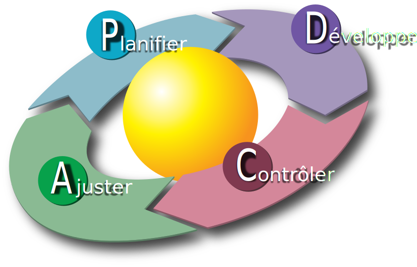

# Les principes de DevOps

* Un objectif commun
* Un processus unifiant le DEV et l'OPS
* Le modèle CALMS
* Infrastructure as Code
* GitOps
* Docs as Code
* L'observabilité

---

## Un objectif commun (1/2)

La séparation des DEV et des OPS conduit à des objectifs distincts :

* Les DEV veulent livrer rapidement des évolutions
* Les OPS doivent avant tout assurer la disponibilité

Il en résulte le mur de la confusion :

---

## Un objectif commun (2/2)

Pour rémédier à cette situation, il sera impératif de **replacer le produit et la création de valeur au centre** en fixant un commun aux DEV et OPS :

**Livrer rapidement des évolutions tout en assurant la disponibilité**

---

## Un processus unifiant le DEV et l'OPS (1/2)

Le partage de ce même objectif conduira à **unifier les processus de développement et de déploiement** :

    

---

## Un processus unifiant le DEV et l'OPS (2/2)

On reconnaîtra dans ce processus la **roue de Deming** bien connue dans le **domaine de la qualité** :

    
    

    (Source : <a href="https://commons.wikimedia.org/wiki/File:PDCA_Cycle_FR.svg">wikimedia.org - Michel Weinachter</a>)
    

---

## Un processus sujet à l'amélioration continue

Il convient de souligner que la mise en oeuvre d'un tel processus prendra du temps et qu'il sera toujours perfectible.

A ce titre, il conviendra d'**améliorer en continu ce processus**.

---

## Le modèle CALMS

### Culture (1/3)

Il convient de souligner que la **gestion des infrastructures est un sujet sensible**. Pour faire évoluer les pratiques et les processus, il faudra d'abord une compréhension partagée :

* De **ce qu'est l'agilité dans le développement** (et de ce que ça implique au niveau de l'exploitation, de la prévibilité des coûts, des plannings de livraison des fonctionnalités...) 
* Des **limites des méthodes d'exploitation traditionnelle** (d'où les nombreuses slides)
* Des **problèmes et améliorations possibles**

---

## Le modèle CALMS

### Culture (2/3)

Pour faire simple, avant de cibler une **infrastructure agile**, il faut être nombreux à voir qu'il y a un problème quand :

* Il faut des jours pour relivrer une application avec une mise à jour de ses dépendances (cas récent : [faille Log4Shell](https://fr.wikipedia.org/wiki/Log4Shell))
* Il faut exhumer une procédure pour re-déployer cette application (et croiser les doigts pour que le procédure soit à jour)
* Il faut faire signer une commande de VM pour faire face à un pic de charge (en ayant prévue la commande l'année précédente)
* Il faut maintenir des documents word contenant ces informations de dimensionnement
* ...

---

## Le modèle CALMS

### Culture (3/3)

En pratique, s'orienter vers la méthode DevOps sera délicat sans une **politique globale permettant l'agilité au niveau de l'entreprise**.

Nous trouverons à ce titre des **framework d'agilité à l'échelle** tels [Scaled agile framework (SAFe)](https://www.scaledagileframework.com/) qui inclueront DevOps dans une démarche plus globale.

Sans entrer dans les détails, avec des projets gérés avec des méthodes hétérogènes (Excel, JIRA, Teams, Redmine, GitHub,...), il sera par exemple difficile d'avoir des métriques pour mettre en évidence les problèmes et les améliorations.

---

## Le modèle CALMS

### Automatisation

DevOps mettra un fort accent sur **l'automatisation**. Elle prendra plusieurs formes :

* L'**automatisation des déploiements** pour éviter les erreurs humaines, livrer rapidement,...
* L'**automatisation des tests** pour limiter les risques liés à l'automatisation, réduire les temps de recette manuelle,...
* L'**automatisation de la surveillance** pour détecter et traiter rapidement les problèmes
* L'**automatisation de la génération de la documentation** pour s'assurer qu'elle correspond à l'état du système
* ...

---

## Le modèle CALMS

### *Lean*

Avec DevOps, on se concentrera sur la production de valeur en faisant la **chasse aux activités à faibles valeurs ajoutées** entre :

* Le début d'un développement
* La mise à disposition du résultat

On cherche égalemet à réduire les gaspillages, il s'agit par exemple de réduire la quantité de code développé mais pas testé ou testé mais pas mis en production. Le fait d'effectuer des petits changements et de jouer le cycle dev/test/prod régulièrement accélère la cadence du développement.

---

## Le modèle CALMS

### Mesure

"Ce qui ne se mesure pas n'existe pas" (et ce qui n'est pas affiché en rouge sur un graphique ne percutera pas au niveau de la direction).

A ce titre, on s'efforcera avec DevOps de **définir des objectifs et les métriques associées**.

---

## Le modèle CALMS

### Partage (Sharing)

Le **partage** et la **transparence** seront important à plusieurs niveaux. Ils favoriseront :

* La confiance entre les différents acteurs
* La compréhension partagées des objectifs et des enjeux
* Les transferts de compétences entre équipes
* ...

---

## Les métriques

| Objectif                                            | Exemples de métriques                                                             |
| --------------------------------------------------- | --------------------------------------------------------------------------------- |
| Déployer rapidement une nouvelle version            | Nombre de livraison par mois (ou par an au début)                                 |
| Assurer un haut niveau de disponibilité             | Taux de disponibilité                                                             |
| Assurer un haut niveau de performance               | Taux de réponse dans temps acceptable (SLA)                                       |
| Limiter le nombre d'incident                        | Nombre de ticket ouvert                                                           |
| Traiter rapidement les incidents                    | Durée de vie des tickets d'incident                                               |
| Traiter efficacement les problématiques de sécurité | Durée du déploiement d'un patch, nombre de vulnérabilité dans les dépendances,... |

---

## La pertinence et le calcul des métriques

On soulignera que définir des métriques pertinentes et faire en sorte pouvoir les calculer est loin d'être trivial.

A titre d'exemple, il sera par exemple intéressant de :

* Prévoir une catégorisation des incidents pour distinguer les erreurs de programmation, les erreurs de déploiement, les problèmes d'infrastructure,...
* Prévoir plusieurs niveaux d'attente pour les performances des services (degradé, non acceptable)
* ...

Remarque : Se contenter d'avoir des métriques et avoir des métriques non pertinentes sera contre-productif (exemple : traiter les faux positifs dans la détection automatique de faille de sécurité plutôt que mener une véritable analyse des risques!)

---

## Infrastructure as Code

### Principe

L'approche **Infrastructure as Code (IaC)** sera fondamentale en matière d'**automatisation des déploiements**. Elle consiste à gérer une infrastructure informatique à l'aide de programmes :
  
* Les **procédures de déploiement** deviennent des **scripts de déploiements**.
* Les **informations prisonnières des documents** deviennent des **paramètres ou des secrets** pour ces scripts de déploiement.

---

## Infrastructure as Code

### Plusieurs étages à configurer

L'automatisation d'un déploiement concernera plusieurs couches du système :

* La création des ressources systèmes (machines virtuelles, réseaux privés,...)
* La configuration du système (installer et configurer les "middlewares")
* Le déploiement de l'applicatif
* Les services d'infrastructure (reverse proxy/load balancer, DNS,...)

---

## Infrastructure as Code

### Une automatisation partielle possible mais limitante

L'**automatisation pourra être partielle** en fonction des possibilités offertes par l'infrastructure et de la politique de l'entreprise mais il faudra **être conscient des conséquences**.

A titre d'exemple, si l'exposition des services (reverse proxy/load balancer) n'est pas automatisée :

* Comment pourrez vous **avoir un système qui s'adapte à la charge**?
* Comment pourrez vous **éviter les indisponibilités pendant les déploiements**?

---

## Infrastructure as Code

### Pré-requis : choisir des outils compatibles avec l'automatisation!

L'approche IaC laissera une grande liberté de choix dans les outils. Il conviendra toutefois d'**être attentif aux méthodes de configuration disponibles lors du choix des outils** :

* **Une API est disponible** pour configurer l'outil?
* La configuration est basée sur des **fichiers de configuration**?
* La configuration est basée sur des **variables d'environnements**?
* La configuration se fait par des **appels en ligne de commande**?

En substance, les outils pouvant être configurés <u>uniquement</u> via une IHM sont à bannir!

---

## GitOps

L'approche [**GitOps**](https://www.redhat.com/fr/topics/devops/what-is-gitops) ira un cran plus loin que Infrastructure as Code :

* La branche principale du dépôt IaC sera le reflet de l'état du système
* La validation d'une **pull request** sur la branche principale déclenchera le déploiement

Ceci permettra entre autre de répondre à des problématiques de **tracabilité des déploiements** :

* Qui a lancé quelle version du script de déploiement?
* Qui a proposé/validé la configuration?

---

## Docs as Code

Pour la documentation, on soulignera l'importance de l'approche [**Docs as Code**](https://www.writethedocs.org/guide/docs-as-code/) consiste à **gérer la documentation avec les mêmes outils que ceux qui servent à construire des applications** :

* Le **système de gestion de ticket** permet de **gérer les évolutions et les anomalies**.
* Le gestionnaire de code source (GIT) permet de **versionner le code source de la documentation** et de **prévisualiser le contenu**.
* Le source du document est au format texte (Markdown, reStructuredText, Asciidoc).
* Le mécanisme de revue de code est utilisé pour les revues de documentation.
* La chaîne CI/CD permet de **générer et de publier la documentation**.

Cette approche a de nombreux avantages. Dans le cas de DevOps, elle est importante pour :

* Assurer la **cohérence entre la description du système et l'état du système**
* Ne pas **gaspiller de l'énergie en traitant manuellement des mises à jour de document**

---

## L'observabilité

### La supervision du système

> TODO : principes et quelques outils (parler des APM)

---

## L'observabilité

### Les journaux applicatifs

> TODO : principes et quelques outils (ELK/EFK)

---

## L'observabilité

### Les sondes web

> TODO : principes et quelques outils (UptimeRobot, prometheus/grafana,...)

---
