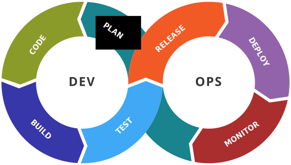

# Les principes de DevOps

* Un objectif commun
* Un processus unifiant le DEV et l'OPS
* Le modèle CALMS
* Les métriques
* L'observabilité
* Infrastructure as Code
* GitOps et le déploiement en continu
* Docs as Code
* Everything as code!

---

## Un objectif commun (1/2)

La séparation des DEV et des OPS conduit à des objectifs distincts :

* Les DEV veulent livrer rapidement des évolutions
* Les OPS doivent avant tout assurer la disponibilité

Il en résulte le mur de la confusion :

---

## Un objectif commun (2/2)

Pour rémédier à cette situation, il sera impératif de **replacer le produit et la création de valeur au centre** en fixant un objectif commun aux DEV et OPS :

**Livrer rapidement des évolutions tout en assurant la disponibilité**

---

## Un processus unifiant le DEV et l'OPS (1/2)

Le partage de ce même objectif conduira à **unifier les processus de développement et de déploiement** :

    

---

## Un processus unifiant le DEV et l'OPS (2/2)

On reconnaîtra dans ce processus la **roue de Deming** bien connue dans le **domaine de la qualité** :

    
    

    (Source : <a href="https://commons.wikimedia.org/wiki/File:PDCA_Cycle_FR.svg">wikimedia.org - Michel Weinachter</a>)
    

On notera qu'il est principalement question de **ne pas avoir deux processus distincts**.

---

## Un processus sujet à l'amélioration continue

Il convient de souligner que la mise en oeuvre d'un tel processus prendra du temps et qu'il sera toujours perfectible.

A ce titre, il conviendra d'**améliorer en continu ce processus**.

---

## Le modèle CALMS

### Culture (1/3)

Il convient de souligner que la **gestion des infrastructures est un sujet sensible**. Pour faire évoluer les pratiques et les processus, il faudra d'abord une compréhension partagée :

* De **ce qu'est l'agilité dans le développement** (et de ce que ça implique au niveau de l'exploitation, de la prévibilité des coûts, des plannings de livraison des fonctionnalités...) 
* Des **limites des méthodes d'exploitation traditionnelle** (d'où les nombreuses slides)
* Des **problèmes et améliorations possibles**

---

## Le modèle CALMS

### Culture (2/3)

Pour faire simple, avant de cibler une **infrastructure agile**, il faut être nombreux à voir qu'il y a un problème quand :

* Il faut des jours pour relivrer une application avec une mise à jour de ses dépendances (cas récent : [faille Log4Shell](https://fr.wikipedia.org/wiki/Log4Shell))
* Il faut exhumer une procédure pour re-déployer cette application (et croiser les doigts pour que le procédure soit à jour)
* Il faut faire signer une commande de VM pour faire face à un pic de charge (en ayant prévue la commande l'année précédente)
* Il faut maintenir des documents word contenant ces informations de dimensionnement
* ...

---

## Le modèle CALMS

### Culture (3/3)

En pratique, s'orienter vers la méthode DevOps sera délicat sans une **politique globale permettant l'agilité au niveau de l'entreprise**.

Nous trouverons à ce titre des **framework d'agilité à l'échelle** tels [Scaled agile framework (SAFe)](https://www.scaledagileframework.com/) qui inclueront DevOps dans une démarche plus globale.

Sans entrer dans les détails, avec des projets gérés avec des méthodes hétérogènes (Excel, JIRA, Teams, Redmine, GitHub,...), il sera par exemple difficile d'avoir des métriques pour mettre en évidence les problèmes et les améliorations.

---

## Le modèle CALMS

### Automatisation

DevOps mettra un fort accent sur **l'automatisation**. Elle prendra plusieurs formes :

* L'**automatisation des déploiements** pour éviter les erreurs humaines, livrer rapidement,...
* L'**automatisation des tests** pour limiter les risques liés à l'automatisation, réduire les temps de recette manuelle,...
* L'**automatisation de la surveillance** pour détecter et traiter rapidement les problèmes
* L'**automatisation de la génération de la documentation** pour s'assurer qu'elle correspond à l'état du système
* ...

---

## Le modèle CALMS

### *Lean*

Avec DevOps, on se concentrera sur la production de valeur en faisant la **chasse aux activités à faibles valeurs ajoutées** entre :

* Le début d'un développement
* La mise à disposition du résultat

On cherche égalemet à réduire les gaspillages, il s'agit par exemple de réduire la quantité de code développé mais pas testé ou testé mais pas mis en production. Le fait d'effectuer des petits changements et de jouer le cycle dev/test/prod régulièrement accélère la cadence du développement.

---

## Le modèle CALMS

### Mesure

"Ce qui ne se mesure pas n'existe pas" (et ce qui n'est pas affiché en rouge sur un graphique ne percutera pas au niveau de la direction).

A ce titre, on s'efforcera avec DevOps de **définir des objectifs et les métriques associées**.

---

## Le modèle CALMS

### Partage (Sharing)

Le **partage** et la **transparence** seront important à plusieurs niveaux. Ils favoriseront :

* La confiance entre les différents acteurs
* La compréhension partagées des objectifs et des enjeux
* Les transferts de compétences entre équipes
* ...

---

## Les métriques

### Introduction

On soulignera que **définir des métriques pertinentes** et **faire en sorte pouvoir les calculer** est loin d'être trivial.

Se contenter d'avoir des métriques et [avoir des métriques non pertinentes sera contre-productif](annexe/metrique-contre-productive.html).

Nous allons ici nous limiter à quelques métriques parlantes et pas très complexe à calculer. Vous en rencontrerez bien d'autres.

---

## Les métriques

### Les métriques DevOps (1/3)

Les métriques suivantes seront caractéristiques de l'**automatisation du déploiement** :

* La **fréquence de déploiement** (par an, par mois,... variable selon la maturité)
* La **durée de déploiement** où il sera intéressant de distinguer :
  * La **durée de déploiement d'une évolution ou d'un correctif mineur** (automatisation de la gestion du déploiement)
  * La **durée de déploiement d'une évolution majeure** (automatisation de la gestion de l'infrastructure)

---

## Les métriques

### Les métriques DevOps (2/3)

Les métriques suivantes donneront une indication sur la qualité de l'**automatisation du déploiement** :

* Le taux d'échec des déploiements
* Le temps moyen pour résoudre un problème d'indisponibilité (**Mean Time To Recovery (MTTR)**)

---

## Les métriques

### Les métriques DevOps (3/3)

La mesure du temps moyen pour détecter une problème (*Mean Time To Detect (MTTD)*) donnera quand à elle une indication sur la qualité de l'instrumentation de l'infrastructure.

---

## Les métriques

### Les métriques de qualité du code

Pour mesurer la qualité du code, il sera possible de s'appuyer sur :

* Le **taux de couverture du code par les tests** ("coverage")
* Les **indicateurs produits par les outils d'analyse statique du code** tels [SonarQube](https://www.sonarqube.org/)
* Les **indicateurs produits par les outils d'analyse des dépendances** (nombre de dépendances obsolètes, vulnérables,...)

Remarque :

* SonarQube a le mérite d'offir une interface unifiée pour différents langages (ce qui plait aux décideurs).
* Les outils d'analyse de code dédiés aux langages (jshint, jslint, phpmd, phpstan,...) offriront parfois des alertes et une démarche plus "as code".

---

## Les métriques

### Les métriques de qualité du développement

Les indicateurs suivants donneront une vision plus globale de la qualité d'une application :

* Volume de ticket incident (par mois, par an,...)
* Nombre de ticket incident ouvert
* Durée de vie moyenne des tickets incidents

On soulignera que le calcul de ces métriques sera délicat sans :

* L'utilisation d'un système de ticket pour la gestion des incidents (Jira, redmine, issues du gestionnaire de code source,...)
* Une gestion rigoureuse des tickets (demande vs incident, gravité des incidents,...) avec l'ajout des métadonnées nécessaires au calcul des métriques.

---

## L'observabilité

### Introduction

Une compréhension vision partagée du comportement du système et des contraintes qu'il subit sera importante pour un travail efficace entre les DEV et les OPS.

---

## L'observabilité

### La supervision du système

Les outils de supervision système ([grafana/prometheus](https://grafana.com/grafana/dashboards/1860-node-exporter-full/), [centreon](https://www.centreon.com/), [munin](https://munin.openstreetmap.org/), [netdata](https://www.netdata.cloud/),...) permettent de :

* Surveiller la consommation de ressource (RAM, CPU, stockage, bande passante,...)
* Mettre en oeuvre des alertes pour :
  * Éviter l'apparition de problèmes (si >=90% de stockage utilisé)
  * Détecter des problèmes (atteinte de limite de bande passante, limite de nombre de connexion simultanées, >=80% de CPU utilisé pendant 10 minutes)

Ils offrent au passage un terrain de discussion intéressant entre les DEV et les OPS.

---

## L'observabilité

### Les sondes web

Une sonde web interroge périodiquement une URL en vérifiant la réponse (code de retour 200) et en mesurant le temps de réponse. Elle permet ainsi de :

* Mesurer un **taux de disponibilité**
* Mesurer un **temps de réponse moyen** (indicateur de performance)
* Mettre en oeuvre une **alerte pour traiter au plus vite une indisponibilité**

On soulignera que la mise en oeuvre est triviale avec des outils tels [UptimeRobot](https://uptimerobot.com/).

On notera qu'il sera intéressant de prévoir des URL dédiées à la surveillance (ex : `/health/db`, `/health/wfs-geoportail`,...) pour faciliter l'interprétation des problèmes au niveau des sondes dans les applications complexes.

---

## L'observabilité

### Les journaux applicatifs

En cas de problème, il sera nécessaire d'**avoir une vision sur les traitements réalisés dans une application**.

En ce sens, il convient de **produire des journaux applicatifs exploitables** et de les centraliser dans un **puit de log** offrant une interface de recherche efficace.

La référence historique en la matière est la suite ELK où :

* **ElasticSearch** est utilisée pour stocker les journaux applicatifs
* **Logstash** analse

---

## L'observabilité

### Les traces des appels

Pour diagnostiquer des problèmes de performances dans des systèmes complexes, il sera intéressant d'instrumenter le système avec un outil tel [jaeger](https://www.jaegertracing.io/docs/1.38/#trace-detail-view) qui permettra d'avoir le détail des temps de traitement derrière une requête.

---

## Infrastructure as Code

### Principe

L'approche **Infrastructure as Code (IaC)** sera fondamentale en matière d'**automatisation des déploiements**. Elle consiste à gérer une infrastructure informatique à l'aide de programmes :
  
* Les **procédures de déploiement** deviennent des **scripts de déploiements**.
* Les **informations prisonnières des documents** deviennent des **paramètres ou des secrets** pour ces scripts de déploiement.

---

## Infrastructure as Code

### Plusieurs étages à configurer

L'automatisation d'un déploiement concernera plusieurs couches du système :

* La création des ressources systèmes (machines virtuelles, réseaux privés,...)
* La configuration du système (installer et configurer les "middlewares")
* Le déploiement de l'applicatif
* Les services d'infrastructure (reverse proxy/load balancer, DNS,...)

---

## Infrastructure as Code

### Quels sont les pré-requis?

L'approche IaC laissera une grande liberté de choix dans les outils du cadre technique dès lors qu'ils sont **compatibles avec l'automatisation**. Il conviendra principalement d'**être attentif aux méthodes de configuration disponibles** :

* **Une API est disponible** pour configurer l'outil?
* La configuration est basée sur des **fichiers de configuration**?
* La configuration est basée sur des **variables d'environnements**?
* La configuration se fait par des **appels en ligne de commande**?

En substance, les outils pouvant être configurés <u>uniquement</u> via une IHM sont à bannir!

---

## Infrastructure as Code

### Quelles bonnes pratiques?

On veillera à s'assurer que les scripts de configuration puissent :

* Ếtre exécuter plusieurs fois (**[indépotence](annexe/iac-indepotence.html)**)
* Être interrompu et relancé (**atomicité**)
* [Cohabiter avec d'autres](annexe/iac-cohabitation.html)
* Être testés par exemple avec des environnements de qualification et de pré-production.
* Permettre à la fois la mise à jour du système et sa reconstruction.

En outre, on notera qu'**on privilégiera une approche déclarative** à une approche impérative pour faciliter la mise en oeuvre de ces principes.

---

## Infrastructure as Code

### Une automatisation partielle possible mais limitante

L'**automatisation pourra être partielle** en fonction des possibilités offertes par l'infrastructure et de la politique de l'entreprise mais il faudra **être conscient des conséquences**.

A titre d'exemple, si l'exposition des services (reverse proxy/load balancer) n'est pas automatisée :

* Comment pourrez vous **avoir un système qui s'adapte à la charge**?
* Comment pourrez vous **éviter les indisponibilités pendant les déploiements**?

---

## Infrastructure as Code

### Quels outils pour l'automatisation des déploiements?

Les outils disponibles varieront en fonction de la cible. Nous verrons par la suite ces outils en abordant :

* DevOps avec des environnements basé sur des machines virtuelles
* DevOps avec des environnements basé sur des conteneurs

---

## GitOps et le déploiement en continu

L'approche [**GitOps**](https://www.redhat.com/fr/topics/devops/what-is-gitops) ira un cran plus loin que Infrastructure as Code :

* La branche principale du dépôt IaC sera le reflet de l'état du système
* La validation d'une **pull request** sur la branche principale déclenchera le déploiement

Cette approche permettra de :

* Mettre en oeuvre un **déploiement en continu**
* Résoudre des problématiques de **tracabilité des déploiements** :
  * Qui a lancé quelle version du script de déploiement?
  * Qui a proposé/validé la configuration?
* S'appuyer sur **cadre de gestion des droits du gestionnaire de code source** :
  * Les branches protégées
  * Les rôles habilités à valider les *pull request*

---

## Docs as Code (1/2)

### Principe

Pour la documentation, on soulignera l'importance de l'approche [**Docs as Code**](https://www.writethedocs.org/guide/docs-as-code/) consiste à **gérer la documentation avec les mêmes outils que ceux qui servent à construire des applications** :

* Le **système de gestion de ticket** permet de **gérer les évolutions et les anomalies**.
* Le gestionnaire de code source (GIT) permet de **versionner le code source de la documentation** et de **prévisualiser le contenu**.
* Le source du document est au format texte (Markdown, reStructuredText, Asciidoc).
* Le mécanisme de **merge request** est exploité pour valider des modifications.
* La chaîne CI/CD permet de **générer et de publier la documentation**.

---

## Docs as Code (2/2)

### Intérêt

Cette approche a de nombreux avantages. Dans le cas de DevOps, elle est importante pour :

* Assurer la **cohérence entre la description du système et l'état du système**
* Ne pas **gaspiller de l'énergie en traitant manuellement des mises à jour de document**
* Que la **production documentaire ne freine pas le rythme des déploiements**

Plus généralement, vous aurez sûrement la chance de comparer avec d'autres approches où :

* Les documents sont extraits d'une solution bureautique, édité sur un poste et renvoyé par mail
* Vous vous demandez où est la dernière version du document (c.f. point précédent...)
* Vous perdrez les traces des modifications (qui a introduit ou levé cette exigence? quand? pourquoi?)
* ...

---

## Everything as Code!

Au final, il sera très vite tentant de gérer un maximum d'élément à l'aide du gestionnaire de code source car il offre **un cadre pour la gestion des évolutions**.

Il est intéressant de voir apparaître :

* Des standards *as code* (ex : [cnigfr - PCRS](https://github.com/cnigfr/PCRS#pcrs))
* Des référentiels *as code* quand la volumétrie le permet (ex : [BaseAdresseNationale/codes-postaux](https://github.com/BaseAdresseNationale/codes-postaux#codes-postaux), [gregoiredavid/france-geojson](https://github.com/gregoiredavid/france-geojson#france-geojson),...)
* ...
