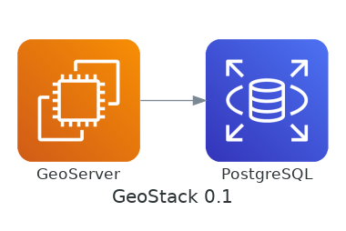
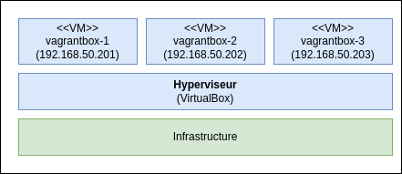
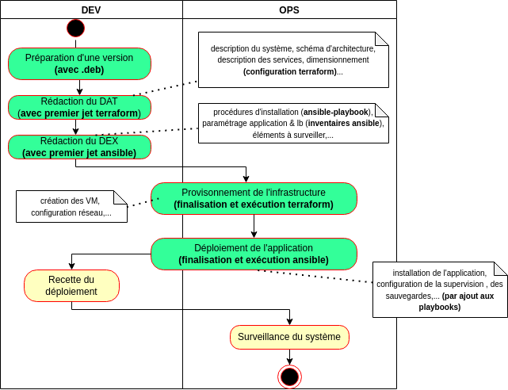
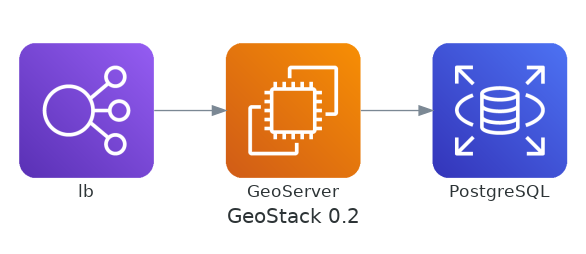
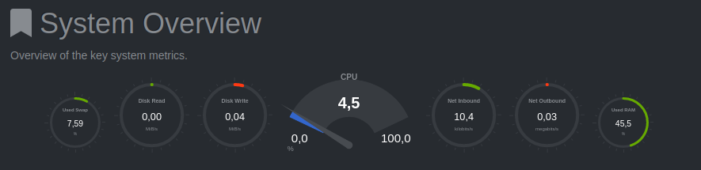

# DevOps avec des VM

* Contexte
* Architecture initiale
* La création d'un livrable
* La création des VM
* Le déploiement de l'application
* Que manque-t'il?
* L'incontournable zone d'hébergement

---

## Contexte

Nous allons voir en pratique comment se passe le déploiement d'une application **as code** sur des VM linux en déployant :

* [PostgreSQL](https://www.postgresql.org/) avec l'extension [PostGIS](https://postgis.net/) pour stocker des données géographiques.
* [GeoServer](https://geoserver.org/) pour diffuser ces données en WMS et WFS.

Nous appelerons le système résultant **GeoStack** (afin d'avoir un nom de base pour le dépôt dédié au déploiement : `geostack-deploy`)

---

## Architecture initiale

Nous commencerons par l'architecture triviale suivante :



Nous en étudierons les limites par la suite.

---

## La création d'un livrable (1/4)

### Ne pas construire l'application en PRODUCTION

<span style="color: red; font-weight">Construire une application sur la PRODUCTION amène de nombreux problèmes :</span>

* Le risque de **ne pas pouvoir redéployer l'application en cas de problème** (ex : disparition d'une dépendance, indisponibilité d'un service,...)
* Une augmentation de la durée du déploiement
* La construction sur chaque instance.
* ...

NB : L'utilisation de fichier `package-lock.json`, `composer.lock`,... ne vous protégera que contre une montée en version innatendue des dépendances.

---

## La création d'un livrable (2/4)

### Produire et stocker un livrable à déployer

Pour le déploiement d'une application en PRODUCTION, il est important de :

* **Tagger une version** au niveau du gestionnaire de code source (ex : `v0.1.0`).
* **Produire un livrable** pour cette version du code.
* [Stocker ce livrable](annexe/stockage-artefact.html).
* Déployer en PRODUCTION un livrable stocké en lieu sûr.

(c.f. [Les 12 facteurs - V. Assemblez, publiez, exécutez](https://12factor.net/fr/build-release-run))

> Ce principe n'interdit pas de déployer en continu une version correspondant à la branche principale dans un environnement de DEV.

---

## La création d'un livrable (3/4)

### Choisir des services déjà packagés

Dans le cas présent, nous avons cette chance :

* [PostgreSQL](https://www.postgresql.org/download/) met à disposition des binaires pour différents systèmes. Nous avons même un dépôt [apt.postgresql.org](http://apt.postgresql.org/) qui permettra d'utiliser `apt-get install` et `apt-get upgrade`
* [GeoServer](https://geoserver.org/release/stable/) met lui aussi à disposition des livrables prêts à l'emploi.

---

## La création d'un livrable (4/4)

### Packager sa propre application

Dans le cas où il convient de créer un livrable pour sa propre application, on remarquera que :

* Il existe une **grande variété de formats de livrables possibles** fonction des technologies et OS cible (c.f. [format supportés par Nexus qui permet de créer différents types de dépôt](https://help.sonatype.com/repomanager3/nexus-repository-administration/formats) )
* Packager des applications telles PostgreSQL est un métier (construire et maintenir des .deb ou .rpm dans les règles de l'art n'est pas trivial).
* Dans le cas des **langages interprétés** (NodeJS, PHP...) :
  * Nous pourrons nous contenter en guise de livrable d'une simple archive (**.zip avec le code de la version + les dépendances**)
  * Nous pourrons aussi facilement produire des .deb ou .rpm avec des outils tels [FPM](https://fpm.readthedocs.io)

Nous n'entrerons pas trop dans le détail (*spoiler* : nous verrons comment l'utilisation de conteneurs solutionne ce problème)

---

## La création des VM (1/5)

### La variété des API

Il existe une grande variétés d'offres d'hébergement offrant une API permettant de contrôler :

* Les machines virtuelles (*compute*)
* Les réseaux privés (*network*)
* Le stockage (*storage*)
* L'exposition de service (*Load Balancer*)
* Un nom de domaine / DNS (1)
* ...

Nous trouverons des **concepts spécifiques à chaque solution dans ces API** (c.f. [API OVHCloud](https://api.us.ovhcloud.com/console/), [API Scaleway](https://developers.scaleway.com/en/), [DigitalOcean API (2.0)](https://docs.digitalocean.com/reference/api/api-reference/)...)

> (1) Particulièrement pratique pour générer des certificats wildcard [LetsEncrypt](https://letsencrypt.org/fr/) avec [lego](https://go-acme.github.io/lego/dns/)

---

## La création des VM (2/5)

### Terraform

Pour **gérer une infrastructure "as code" en production** sans programmer les appels à ces API, nous pourrions nous appuyer sur **[Terraform](https://www.terraform.io/intro#how-does-terraform-work)** qui apporte :

* Un **langage déclaratif** pour la création des ressources (machine virtuelle, réseau,...)
* Le support d'un [grand nombre de **fournisseurs**](https://registry.terraform.io/browse/providers) dont :
  * Les clouds publics : [AWS](https://registry.terraform.io/providers/hashicorp/aws/latest/docs), [Azure](https://registry.terraform.io/providers/hashicorp/azurerm/latest/docs), [Google Cloud Platform](https://registry.terraform.io/providers/hashicorp/google/latest),...
  * Les clouds privés : [vsphere](https://registry.terraform.io/providers/hashicorp/vsphere/latest/docs), [openstack](https://registry.terraform.io/providers/terraform-provider-openstack/openstack/latest/docs),...


Nous nous contenterons de survoler quelques exemples et de souligner que **Terraform n'est pas stateless** (il convient de [configurer un backend pour le stockage de l'état du système](https://www.terraform.io/language/settings/backends/configuration))

---

## La création des VM (3/5)

### Vagrant (1/3)

Pour la suite, nous allons plutôt utiliser [**Vagrant**](https://www.vagrantup.com/) qui est lui aussi développé par [HashiCorp](https://www.hashicorp.com/) et qui est l'équivalent de [Terraform](https://www.terraform.io/) pour les environnements de développement.

---

## La création des VM (4/5)

### Vagrant (2/3)

Nous utilisons le dépôt [mborne/vagrantbox](https://github.com/mborne/vagrantbox#vagrantbox) pour **démarrer des VM en une commande `vagrant up` à partir d'un fichier [Vagrantfile](https://github.com/mborne/vagrantbox/blob/master/Vagrantfile)** :

<div class="center">
    
</div>

> Nous créons ici des VM [VirtualBox](https://www.virtualbox.org/) mais [Vagrant supporte d'autres fournisseurs (ex : KVM)](https://www.vagrantup.com/docs/providers).

---

## La création des VM (4/4)

### Vagrant (3/3)

Nous soulignerons que :

* La principale difficulté traitée dans le dépôt [mborne/vagrantbox](https://github.com/mborne/vagrantbox#vagrantbox) est l'utilisation optionnelle d'un proxy sortant avec le plugin [vagrant-proxyconf](https://rubygems.org/gems/vagrant-proxyconf/versions/1.5.2).
* Vous trouverez une [annexe/vagrant-helloworld](annexe/vagrant-helloworld.html) pour appendre à créer vos propres `Vagrantfile`.
* Vagrant sera aussi pratique pour créer une VM de DEV Linux avec un environnement graphique (`apt-get install ubuntu-desktop`)

---

## Le déploiement de l'application

### Le déploiement des applications

Nous avons avec Vagrant et Terraform des outils capables de **créer nos VM as code**. Il nous reste à trouver une solution pour procéder de même pour déployer nos applications comme suit :

<div class="center">
    
</div>


---

## Le déploiement de l'application

### Les outils de gestion de configuration

Les outils de **gestion de configuration** sont les plus adaptés pour **installer et configurer nos applications**. Les plus connus sont :

* [Chef](https://docs.chef.io/platform_overview/)
* [Puppet](https://puppet.com/docs/puppet/6/puppet_overview.html)
* [Ansible](https://docs.ansible.com/ansible/latest/index.html)

---

## Le déploiement de l'application

### Le choix d'Ansible

Nous allons nous appuyer sur Ansible qui est une solution :

* [Libre, OpenSource et référencée dans le SILL (1)](https://sill.etalab.gouv.fr/software?name=Ansible)
* Basée sur l'utilisation du format YAML
* Implémentée en Python
* N'imposant pas un serveur de contrôle
* Permettant l'utilisation d'un serveur de contrôle ([AWX](https://github.com/ansible/awx#readme) par exemple).

> (1) [Socle interministériel de logiciels libres](https://sill.etalab.gouv.fr/software) où je ne retrouve plus chef et puppet un temps référencés (changement de licence?).

---

## Le déploiement de l'application

### Les principaux exécutables d'Ansible

Nous trouverons plusieurs exécutable avec Ansible :

* `ansible` qui permettra par exemple de lancer une commande sur les machines d'un inventaire
* `ansible-playbook` qui sera utilisée pour traiter un ensemble de tâches décrites au format YAML.
* `ansible-galaxy` qui permettra de télécharger des rôles partagés pour construire vos playbooks (voir [galaxy.ansible.com](https://galaxy.ansible.com/)).
* `ansible-vault` qui permettra de chiffrer des secrets.

L'[installation pourra être réalisée dans un environnement virtuel python](https://gist.github.com/mborne/eeb3a0177fe27f5ed393a00eded0a86f#file-ansible-venv-md) pour éviter les conflits de version de bibliothèques Python. 

---

## Le déploiement de l'application

### Le déploiement de GeoStack avec Ansible!

Présenter l'ensemble des [concepts ansible](https://docs.ansible.com/ansible/latest/network/getting_started/basic_concepts.html#basic-concepts) demanderait plusieurs séances.

Nous allons ici nous contenter d'une démonstration et de l'analyse d'un exemple [mborne/geostack-deploy - Déploiement de GeoStack avec ansible](https://github.com/mborne/geostack-deploy/blob/master/ansible/README.md#d%C3%A9ploiement-de-geostack-avec-ansible).

---

## Le déploiement de l'application

### Conclusion sur Ansible (1/2)

S'il faut réfléchir dans certains cas, nous soulignerons que bien souvent, la traduction des commandes en YAML est triviale :

```bash
sudo apt-get update
sudo apt-get install nginx
```

...devient :

```yaml
- name: Install nginx
  apt:
    name: nginx
    state: present
    update_cache: yes
```

---

## Le déploiement de l'application

### Conclusion sur Ansible (2/2)

Nous mémoriserons que Ansible permet de **décrire as code le déploiement d'une application avec un fichier YAML** qui sera exploitable comme suit :

```bash
# déploiement en QUALIF
ansible-playbook -i inventory/qualif mon-application.yml
```

Nous insisterons sur l'apport de Ansible pour :

* **Gérer des paramètres** en fonction des environnements (notamment par rapport à des scripts `install-geoserver.sh`)
* **Traiter des actions uniquement en cas de changement** (par exemple pour éviter des redémarrages inutiles)
* **Faciliter la rédaction et la maintenance des déploiements** (YAML et [nombreux modules disponibles](https://docs.ansible.com/ansible/2.9/modules/list_of_all_modules.html) rendant les procédures lisibles même sans connaissance d'Ansible).
* **Permettre la réutilisation de scripts de déploiements complet** (téléchargement de rôles avec `ansible-galaxy`, composition de playbook à partir de rôles,...)

---

## Le déploiement de l'application

### Processus résultant

En terme de répartition des rôles, nous pourrions aboutir par exemple au processus suivant après adoption des outils par les DEV et les OPS :

<div class="center">
    
</div>


---

## Que manque-t'il?

### La sécurité!

Nous ne pourrions pas procéder ainsi avec des VM exposées sur internet :

* Nous finirions sur [www.shodan.io](https://www.shodan.io/)
* Un des nombreux bots qui scannent le web testerait sans relâche nos VM

Il faudrait par exemple :

* Configurer un pare-feu local (par exemple avec [ufw](https://doc.ubuntu-fr.org/ufw))
* Configurer [fail2ban](https://doc.ubuntu-fr.org/fail2ban) pour bloquer les attaques par force brute sur SSH.
* Blinder la configuration des VM ( c.f. [dev-sec.io - DevSec Hardening Framework](https://dev-sec.io/baselines/linux/) )
* ...

> On notera l'existence d'une alternative à [fail2ban](https://doc.ubuntu-fr.org/fail2ban) : [CrowdSec](https://github.com/crowdsecurity/crowdsec#readme) où les IP suspectent sont partagées. On s'assurera de respecter le [RGPD](https://www.cnil.fr/fr/rgpd-de-quoi-parle-t-on) avec ce type d'outil.

---

## Que manque-t'il?

### L'incontournable reverse proxy (1/2)

Il conviendrait à minima de passer sur une architecture du type suivant en ajoutant un reverse proxy ("lb") :



---

## Que manque-t'il?

### L'incontournable reverse proxy (2/2)

Avec un reverse proxy, nous pourrions par exemple :

* Exposer publiquement les seuls services WMS et WFS de GeoServer (`/wms`, `/wfs`)
* Exposer l'interface d'interface d'administration avec un filtrage par IP (`/geoserver`)

---

## Que manque-t'il?

### La mise en oeuvre de HTTPS

**Tant que nous serons en HTTP, le mot de passe de l'administrateur GeoServer circulera en clair sur le réseau**. Il conviendrait donc de mettre en oeuvre HTTPS pour y remédier.

Nous soulignerons que :

* HTTPS pourrait être mis en oeuvre au niveau du reverse proxy
* La mise en oeuvre HTTPS requière l'achat d'un certificat ou la génération de celui-ci avec [Let's Encrypt](https://letsencrypt.org/fr/)
* Pour les services exposés sur INTERNET, il existe des outils pour tester et blinder la configuration de TLS (cyphers, entêtes de sécurité, chaîne de certification...) tels :
  * [https://www.ssllabs.com/ssltest/](https://www.ssllabs.com/ssltest/)
  * [www.sslshopper.com](https://www.sslshopper.com/)
* Pour les services non exposés (intranet, RIE), il faudra maîtriser `openssl` pour diagnostiquer et détecter ces problèmes.

---

## Que manque-t'il?

### L'observabilité

Pour pouvoir exploiter ces deux composants, il faudrait :

* Configurer la **centralisation des logs**
* Configurer un **système de supervision**



---

## Que manque-t'il?

### Les sauvegardes (1/2)

En l'état, **si l'une de nos machines vient à s'embraser : Les données sont perdues**. Il serait donc important d'adopter une stratégie de sauvegarde et plusieurs options sont possibles :

* S'appuyer sur des mécanismes de snapshot de VM.
* Exporter et externaliser régulièrement les seules données de l'application par exemple en créant une archive avec :
  * Une sauvegarde de la base PostgreSQL (`pg_dump`)
  * Les fichiers de GeoServer (`GEOSERVER_DATA_DIR`).

> Voir [Back up and restore GitLab](https://docs.gitlab.com/ee/raketasks/backup_restore.html) où la commande `gitlab-backup create` permet de générer une sauvegarde de la base et des dépôts.

---

## Que manque-t'il?

### Les sauvegardes (2/2)

Les deux options sont à mon sens complémentaires :

* L'approche par snapshot permet de redémarrer rapidement en cas de problème simple.
* L'approche par export des données impose un travail de **cartographie des données** (données métiers, données de configuration, secrets, données temporaires,...) mais offre des avantages non négligeables :
  * Il est relativement simple de **tester ces sauvegardes avec des restaurations régulière des données de la PRODUCTION en RECETTE** (en anonymisant au besoin les données)
  * Ces restaurations régulières sont utiles pour les **tests d'intégration** (ex : valider des scripts de mise à jour de la base de données) et les **tests de performance** (avec des données réalistes)

Quand la volumétrie et la sensibilité des données le permet, il est dommage de ce priver de tels mécanismes et d'attendre un sinistre ou une migration pour cartographier les données.

---

## Que manque-t'il?

### La résilience

Pour les systèmes critiques, il ne sera pas acceptable de devoir attendre la fin d'une restauration de sauvegarde pour que le système redémarre. De même, pour les volumétries importantes, il ne sera pas réaliste de procéder à des sauvegardes complètes.

A ce titre, nous soulignerons que nous pourrions mettre en oeuvre de **mécanismes de redondance** au niveau des composants GeoStack avec des stratégies propres à chaque application :

* [PostgreSQL - High Availability, Load Balancing, and Replication](https://www.postgresql.org/docs/current/high-availability.html)
* [GeoServer - Clustering GeoServer](https://docs.geoserver.geo-solutions.it/edu/en/clustering/index.html#clustering-geoserver)

Nous verrons plus tard que la mise en oeuvre est plus simple avec des applications conçues pour répondre à cette problématique (ElasticSearch, etcd, MongoDB,...)

---

## L'incontournable zone d'hébergement

### La nécessité de traiter globalement ces problèmes

Il est illusoire d'espérer traiter de manière homogène ces problématiques au niveau de chaque application. Traiter ces problématiques de manière efficace demandera la **mise en place d'une infrastructure** pour l'accueil des applications dont le nom variera entre :

* Zone d'hébergement
* Zone applicative
* *Landing zone* (AWS)
* Socle technique d'exploitation
* ...

---

## L'incontournable zone d'hébergement

### Les principaux composants

Dans la zone d'hébergement, nous trouverons par exemple :

* Un **Bastion SSH** pour l'accès aux VM par les administrateurs
* Un **Reverse Proxy / Load Balancer** communs aux applications
* Des **services supports** (SMTP, DNS, proxy sortant...) communs aux applications
* Des **services de stockages** (PostgreSQL, Redis, MongoDB,...) sur étagères
* Un puits de logs
* Un système de supervision
* Un serveur de déploiement
* ...

---

## L'incontournable zone d'hébergement

### Le délicat recours à un prestataire... (1/2)

En cas de **recours à une équipe dédiée** pour construire cette zone d'hébergement, il conviendra de **s'assurer que la méthode permet l'automatisation des déploiements** :

* **La nécessité de recourir à un ticket pour configurer un seul élément suffira à plomber les capacités d'automatisation**
* **La moindre imprécision dans les demandes sera source de problèmes de cohabitation**

---

## L'incontournable zone d'hébergement

### Le délicat recours à un prestataire... (2/2)

**Poser un cadre "as code"** et **être précis sur les demandes** sera incontournable :

* Avec "je veux des mises à jour régulière", le prestataire ajoutera potentiellement en bonus un `rm -rf /etc/apt/sources.list.d/*` pour reconfigurer ses seuls dépôts.
* Avec "je veux une exécution régulière de `apt-get update && apt-get upgrade -y`, il y aura moins de place pour la fantaisie.

Du moins, ce type de problématique nous aidera à comprendre l'intérêt des conteneurs et de l'orchestration de conteneur que nous allons aborder...

